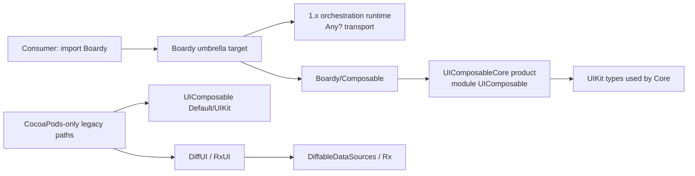
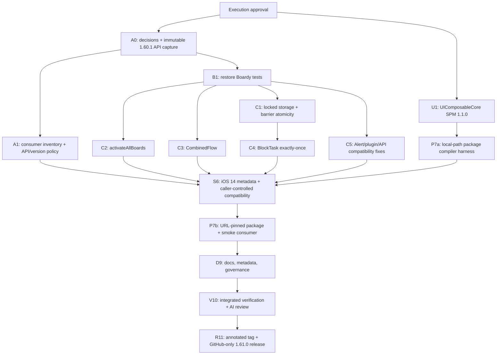

# Boardy Option A — 1.x Hardening Implementation Plan

> **For agentic workers:** REQUIRED SUB-SKILL: Use superpowers:subagent-driven-development (recommended) or superpowers:executing-plans to implement this plan task-by-task. Steps use checkbox (`- [ ]`) syntax for tracking.

**Goal:** Harden kiến trúc Boardy 1.x theo Option A thành pre-G1 release `1.61.0`, có correctness regressions được bảo vệ, contract executor hiện hữu được ghi rõ, SwiftPM-first compatibility validation bằng Swift 5 mode trên Xcode 26.4.1 và operating baseline cho open source; giữ runtime transport `Any?` và cách dùng `import Boardy`. Theo versioning policy do requester chọn, deployment floor iOS 12 → 14 được phát hành ở minor; major dành cho một big update. PR #10 đã merge, hosted CI và CocoaPods lint đã pass trên exact merge SHA, annotated tag `1.61.0` đã publish; GitHub Release object chưa xác minh được qua API. Release vẫn pre-G1; Swift 6 language mode, MainActor isolation, older-runtime/device evidence, signed release, SBOM/provenance và CocoaPods trunk publication nằm ngoài evidence hiện tại.

**Architecture:** Giữ nguyên một umbrella module `Boardy`, public programming model và caller-controlled synchronous executor hiện tại. Boardy 1.61.0 không thêm `@MainActor`, global-actor annotation, main-thread precondition hay queue hop mới; UIKit callers tiếp tục chịu trách nhiệm gọi từ main thread theo contract của UIKit. Toàn bộ ordered terminal path của `BlockTaskBoard` tiếp tục chạy trên legacy executor và giữ nguyên observable ordering. Storage thực sự dùng chung giữa thread được bảo vệ bằng một primitive khóa nhỏ; callback không chạy trong lock. SwiftPM của Boardy phụ thuộc product `UIComposableCore` từ release UIComposable `1.1.0`, nên bao gồm được toàn bộ `Boardy/Composable` mà không kéo `DiffUI`, Rx hoặc `DiffableDataSources`.

**Tech Stack:** SwiftPM tools baseline 5.9, Boardy Swift 5 language mode, iOS 14+, Xcode 26.4.1 đang cài trên máy, duy nhất iPhone 17 Simulator (UDID `714C9786-1327-41DF-A093-73359C82E0C2`) cho executable test, XCTest và Swift Package Manager. UIComposableCore prerequisite đã được verify độc lập ở Swift 5/6; Boardy Swift 6 language mode thuộc follow-up. Hosted CI later verified the merge SHA on `macos-26` / Xcode 26.4.1, including CocoaPods build/test and pod lint; older-runtime/device matrix, N-1 Xcode, CocoaPods trunk publication và GitHub Release object verification remain outside current evidence.

**Toolchain paths:** Use the Xcode selected by `xcode-select` by default; set `DEVELOPER_DIR` only when multiple installations are present. Paths are never trusted without the version checks in Task 13.

```bash
export XCODE_26_4_1_DEVELOPER_DIR="${XCODE_26_4_1_DEVELOPER_DIR:-$(xcode-select -p)}"
# Leave DEVELOPER_DIR unset on the single-Xcode workstation; set it only when an override is needed.
export BOARDY_LOCAL_BUILD_ROOT="$PWD/.build-local"
export TMPDIR="$BOARDY_LOCAL_BUILD_ROOT/tmp"
mkdir -p \
  "$TMPDIR" \
  "$BOARDY_LOCAL_BUILD_ROOT/DerivedData" \
  "$BOARDY_LOCAL_BUILD_ROOT/SourcePackages" \
  "$BOARDY_LOCAL_BUILD_ROOT/Results"

local_xcodebuild() {
  local has_derived_data_path=false
  local argument
  for argument in "$@"; do
    if [ "$argument" = "-derivedDataPath" ]; then
      has_derived_data_path=true
      break
    fi
  done

  local local_arguments=(
    -clonedSourcePackagesDirPath "$BOARDY_LOCAL_BUILD_ROOT/SourcePackages"
    -disablePackageRepositoryCache
  )
  if [ "$has_derived_data_path" = false ]; then
    local_arguments+=(
      -derivedDataPath "$BOARDY_LOCAL_BUILD_ROOT/DerivedData/Boardy"
    )
  fi

  xcodebuild "${local_arguments[@]}" "$@"
}
```

## Global Constraints

- Requester đã authorize implementation trực tiếp trên branch, commit/push và UIComposable prerequisite tag. Không dùng worktree. Boardy `1.61.0` annotated tag đã publish sau merge; hosted CI và CocoaPods lint đã pass. CocoaPods trunk publication, signed release, SBOM/provenance và GitHub Release object verification remain outside verified evidence.
- Mọi executable simulator test trong execution này chỉ được target iPhone 17, iOS 26.4. Không boot hoặc target simulator/device khác; iOS 18.3, iPad và multi-device runtime rows được chuyển sang plan CI/compatibility sau. Generic simulator build không khởi động device vẫn được phép để kiểm tra deployment target.
- Option A giữ `Any?` transport. Không thêm typed route core, framework-wide/public ActivationID lifecycle redesign, macro/codegen, async/await API mới hoặc package/module split kiểu Boardy 2. Private transactional phase models tối thiểu cho barrier/task P0 fixes vẫn thuộc scope.
- Không remove hay đổi tên public API trong `1.61.0`. Chỉ cho phép fix behavior, API additive và deprecation có replacement.
- Boardy floor là iOS 14 theo quyết định requester. Platform-floor impact và contract caller-controlled executor không đổi phải có trong `docs/MIGRATING_TO_1.61.md`. Không thêm MainActor/runtime isolation, main-thread precondition hoặc callback hop trong release này.
- Không sửa source trong `Example/Pods`. Sau khi đổi iOS metadata, có thể regenerate CocoaPods project; không chạy CocoaPods test/lint trong execution SPM-first này.
- Không tạo test file Boardy mới trong Phase A để tránh sửa membership thủ công của Xcode project cũ; đặt regression tests vào các file `Example/Tests/*.swift` đã có.
- Không dùng arbitrary sleep trong test mới hoặc test được refactor. Dùng controlled completion, synchronous spy hoặc expectation gắn với event thật.
- Trong production code, `@unchecked Sendable` chỉ được phép cho các type lock/identity đã audit:
  `Locked`, `SafeArray`, `SafeDictionary`, `BarrierOwnerToken` và
  `BlockTaskExecutionOperation`, với invariant được document tại type. Không tạo compatibility
  carrier hoặc thêm conformance rộng mới để né Swift 6 trong release này. Test-only stress fixtures
  được phép dùng conformance hẹp ngay tại fixture khi test đang chứng minh lock invariant.
- Task 9 không được bắt đầu chỉ dựa trên việc approve plan: G0 inputs, consumer blast-radius review và API/versioning policy phải vượt Gate A1 trước khi materialize iOS 14/distribution metadata.
- Không làm broad formatting hoặc Xcode “recommended settings” migration ngoài các build settings được nêu cụ thể.
- Không tạo/sửa `.github/workflows/*`, không xóa `.travis.yml` và không cấu hình required checks trong plan này; toàn bộ hosted-CI mutation thuộc plan `BUILD-002` sau.
- Không stage tool state `.codegraph/` hoặc `.claude/worktrees/`; cả hai được repository-ignore cùng `.build-local/` để `git add .` không vô tình đưa local state vào commit.
- Mọi project-scoped temporary/build artifact phải nằm dưới ignored root `.build-local/` trong repo trên external drive. Không dùng `/tmp`, `~/Library/Developer/Xcode/DerivedData` hoặc cache root bên ngoài workspace; CoreSimulator service state do Xcode quản lý là ngoại lệ hệ thống và không được symlink/move thủ công.
- Trên Xcode 26.4.1, mọi build/test có package dependency phải đi qua `local_xcodebuild`: DerivedData, source checkout và logs nằm dưới `.build-local/`; dùng `-clonedSourcePackagesDirPath` cùng `-disablePackageRepositoryCache`. Không truyền `-packageCachePath` tới một custom cache rỗng: cấu hình đó trả về package graph rỗng và làm mất products `CwlPreconditionTesting`/`CwlPosixPreconditionTesting`.
- Mỗi suggested commit bên dưới là một ranh giới review. Requester đã authorize semantic commit, push, annotated tag và GitHub-only release; `1.61.0` tag đã verify, còn GitHub Release object chưa verify được.

---

## 1. Plan status và baselines

| Thuộc tính | Giá trị |
|---|---|
| Trạng thái | `1.61.0` published annotated tag; PR #10 merged; hosted CI passed; GitHub Release object unverified; pre-G1 follow-up open |
| Phiên bản plan | 0.30.0 |
| Implementation authorization | Branch + commit/push/tag/GitHub Release được authorize; CocoaPods publish excluded |
| Ownership / security | Sole technical/release owner `congnc.if@gmail.com` (`@congncif` verified); backup continuity deferred; private security contact `congnc.if@gmail.com` |
| Boardy baseline | `bfa9579` trên `master` |
| UIComposable baseline | `c31acaf569b8e10d365ba6af0b88d174c646e5b3` trên `master` |
| Boardy release candidate | `1.61.0` — project policy cho phép platform-floor change ở minor; major reserved for big updates |
| UIComposable prerequisite release | `1.1.0` |
| Ngày lập kế hoạch | 2026-07-14 |
| Kết quả mục tiêu | `1.61.0` annotated tag và PR #10 merge đã verify; hosted CI/CocoaPods lint evidence đã pass; GitHub Release object chưa verify; release giữ pre-G1 và không claim organization production support |

### 1.1. Pre-execution baseline evidence đã xác nhận

- Boardy có 64 Swift files, khoảng 6.448 LOC, 15 test files và 33 test methods.
- Trước Task 2, `Boardy_Tests` fail compile tại `Example/Tests/AttachableTests.swift` vì dùng tên cũ `StaticStorage`; checkpoint hiện tại đã sửa và full suite 59/59.
- Swift 6 strict build của toàn CocoaPods workspace fail trong `DiffableDataSources`, không phải source Boardy.
- `UIComposable/Core` biên dịch thành module `UIComposable` ở Swift 6 strict concurrency.
- `UIComposable/Core + UIKit` hiện fail Swift 6 vì `ComposableInterface` chưa có isolation contract.
- Boardy chỉ import các API UIComposable nằm trong `UIComposable/Core`; không dùng `ComposableListViewController`, `DiffUI` hoặc `RxUI`.
- Một SwiftPM harness tạm thời với đúng một target `Boardy`, toàn bộ source hiện tại và dependency Core-only đã build thành công ở Swift 5 cho generic iOS Simulator; điều này xác nhận umbrella product không cần loại `Boardy/Composable`.
- Hai manifest đề xuất cho Boardy và UIComposable đã parse bằng SwiftPM tools 5.9; UIComposable dùng deployment floor iOS 12 để tránh package-manifest deprecation.
- `Example/Podfile.lock` đang giữ UIComposable `0.5.1`; podspec hiện không có version constraint.
- Xcode test target đang dùng `CwlPreconditionTesting 2.2.2` và `CwlCatchException 2.2.1` cho assertion testing.

---

## 2. Decision package submitted for approval

Phê duyệt plan này đồng nghĩa chọn scope và execution constraints dưới đây. `D-004` iOS 14+ và `D-008` minor `1.61.0`/major-reserved-for-big-updates phản ánh quyết định của requester. Requester đã approve `D-005`: Boardy 1.61.0 giữ caller-controlled executor và toàn bộ legacy `BlockTaskBoard` executor/order; mọi MainActor/Swift 6 isolation work được chuyển sang follow-up plan riêng.

| Decision | Proposed decision cho Option A | Consequence |
|---|---|---|
| `D-002` Product positioning | “Legacy-compatible modular orchestration framework with typed façades over a runtime `Any?` transport” | Không claim end-to-end type safety |
| `D-003` Evolution | Option A: harden 1.x only | Boardy 2 work được deferred |
| `D-004` Candidate matrix | iOS 14+; Xcode 26.4.1 đang cài; executable tests chỉ trên iPhone 17 Simulator iOS 26.4; CocoaPods và SwiftPM verified ở Swift 5 language mode | Requester yêu cầu không start/target device khác; Swift 6 language mode, older-runtime/device, N-1 Xcode và CI-enforced support đều deferred |
| `D-005` Concurrency | Giữ caller-controlled synchronous executor trong 1.61.0; không thêm actor annotation, main-thread precondition hoặc queue hop; lock cho shared storage; giữ toàn bộ legacy `BlockTaskBoard` executor + ordering | MainActor/Swift 6 isolation và additive executor API chuyển sang plan/RFC riêng; public-interface diff và behavior tests phải chứng minh không đổi contract |
| `D-006` SwiftPM structure | Một umbrella product/module `Boardy`; không split public modules trong 1.x | Giữ `import Boardy` và giảm migration |
| `D-008` Compatibility | `1.61.0`; project policy cho phép drop iOS 12/13 trong minor; major chỉ dùng cho big update; không remove/rename public declarations | Không gọi policy này là strict SemVer; migration/platform impact phải explicit |
| `D-009` Task cancellation | Cooperative cancellation, exactly one terminal callback, late callback bị bỏ qua | Fix `BlockTaskBoard` có behavior contract đo được |
| `D-011` Governance | ADR cho architecture cục bộ; RFC trước public API mới | Decision history audit được |
| `D-013` Composable | Boardy SwiftPM umbrella bao gồm Composable qua `UIComposableCore`; UIComposable UIKit/DiffUI/RxUI SPM để phase riêng | Không kéo dependency Swift 6 lỗi vào Boardy |

### 2.1. Organizational inputs

- Đã nhận `D-001`: sole technical/release owner `congnc.if@gmail.com` / `@congncif`; requester chuyển backup continuity sang plan sau và chấp nhận single-owner risk cho 1.61.0.
- Đã capture danh sách consumer/app/module và Boardy version. Release-level disposition được owner duyệt: GitHub-only/opt-in, không CocoaPods publication; consumer hiện hữu giữ version hiện tại cho đến khi owner ứng dụng migrate, pin `< 1.61` hoặc retire.
- `CODEOWNERS` chỉ định đúng confirmed handle `@congncif`; không suy đoán thêm account.
- Đã xác nhận private security contact `congnc.if@gmail.com`; GitHub Private Vulnerability Reporting hiện chưa bật và không được quảng bá như một channel hoạt động.

Sau khi plan được approve, Task 0 và Task 1 ở sibling repo có thể bắt đầu song song. Không Boardy-mutating Task 2–8 nào được bắt đầu trước khi Task 0 đã capture/validate xong immutable `1.60.1` interface + API graph; sau mốc đó chúng có thể hoàn tất trong khi Gate A1 còn pending vì không thay đổi executor contract. Không được bắt đầu Task 9, mark G0/G1, tag hoặc publish khi các organizational input trên chưa được ghi nhận.

### 2.2. Gate A1 — platform/API compatibility readiness

Trước Task 9, tất cả điều kiện sau phải cùng đạt:

- `D-001` có confirmed technical/release owner; backup continuity được ghi rõ là deferred risk và không block release; support matrix đã được owner xác nhận, tức G0 organizational inputs hoàn tất;
- consumer inventory có version/toolchain, integration path, migration-risk classification và release-level disposition cho mọi consumer đã biết; app-level owner assignment không block GitHub-only publication vì adoption là opt-in và CocoaPods không được publish;
- `docs/API_STABILITY_1X.md` và release/deprecation policy được owner duyệt;
- ADR-0001 ghi nhận quyết định defer MainActor/Swift 6 isolation và giữ caller-controlled executor; `D-004`/`D-008` ghi rõ iOS 14 + minor `1.61.0` và major-reserved policy của requester;
- design review cam kết giữ nguyên declaration signature, executor behavior và không thêm global-actor annotation/main-thread precondition/queue hop; public interface đã được chụp ở Task 0;
- mọi consumer dưới iOS 14 có migration, version ceiling hoặc retirement disposition rõ. Executor migration không thuộc release này vì contract không đổi.

Task 1 có thể chạy độc lập ngay sau approval; các task regression/correctness 2–8 có thể hoàn tất trước Gate A1 nhưng chỉ sau immutable Task 0 API capture. Không dùng `@preconcurrency` hoặc `nonisolated(unsafe)` để vượt gate.

---

## 3. Scope

### 3.1. In scope — release candidate `1.61.0` / pre-G1

| Nhóm | Living-roadmap IDs |
|---|---|
| Foundation | `FOUND-003`, `FOUND-004`, `FOUND-005`; artifacts hỗ trợ `FOUND-001` và `FOUND-002` |
| Build/distribution | `BUILD-001`, `BUILD-003`–`BUILD-007`; API-digester baseline/check chạy local, còn hosted enforcement và warning audit chỉ tạo evidence, không đóng CI work item |
| Correctness | `FIX-001`–`FIX-007`, `FIX-010` |
| Concurrency | Lock/correctness work `CONC-003`–`CONC-004` và documentation phần caller-controlled executor của `CONC-001`/`CONC-006` |
| API policy | `API-001`, `API-007` |
| Tests | `TEST-003`, `TEST-005` và deterministic conversions cần cho các regression P0/P1 |
| Documentation | `DOCS-001`–`DOCS-003`, `DOCS-006`, `DOCS-008` |
| OSS/release baseline | `OSS-001`–`OSS-004`, `OSS-007`–`OSS-010`; publication vẫn cần approval riêng |

### 3.2. Explicitly deferred khỏi release này

- `API-002`, `API-003`, `API-004`: typed routing, v2 bridge và Foundation-only core split.
- `BUILD-002`, `BUILD-008`, `BUILD-009`: hosted matrix, warning ownership enforcement và warnings-as-errors policy chuyển sang plan CI riêng. Vì vậy plan hiện tại không thể đóng G1.
- `FIX-008`, `FIX-009`: missing-context typed failure và AdapterBoard ownership redesign.
- `FIX-011`: behavioral URL opener result contract vẫn `Proposed`; Task 8 chỉ document matched-candidate semantics hiện tại, không mark finding này complete.
- `LIFE-001`–`LIFE-006`: activation state machine và broader lifecycle redesign.
- `API-005`, `API-006`: structured diagnostics và async/await API.
- `CONC-002`, `CONC-005`, phần Swift 6/isolation của `CONC-001`/`CONC-006` và
  `CONC-007`: toàn bộ MainActor isolation, framework-wide/public Sendable migration, Swift 6
  language-mode readiness và scheduled TSan/stress CI chuyển sang follow-up plan riêng. Các
  conformance lock-backed nội bộ đã audit vẫn thuộc correctness baseline.
- `TEST-006`–`TEST-008`: full memory/performance/package-direction suites.
- `DOCS-004`, `DOCS-005`, `DOCS-007`: reference sample overhaul, DocC và troubleshooting.
- `OSS-005`, `OSS-006`: automated publishing, signed release, SBOM và provenance.
- `ADOPT-001`–`ADOPT-007`: pilot và organization rollout sau G1.
- UIComposable SPM products cho UIKit, DiffUI và RxUI.

### 3.3. Residual debt được chấp nhận

- Runtime dispatch vẫn có thể mismatch vì `Any?`/runtime cast.
- URL opener synchronous return chỉ có thể phản ánh matched candidates, không phản ánh kết quả selection bất đồng bộ.
- CocoaPods full example tiếp tục build ở Swift 5 language mode vì legacy `DiffableDataSources`.
- Ngay cả khi toàn bộ local verification xanh, chưa được mark G1 hoặc tuyên bố Boardy là framework mặc định toàn tổ chức khi hosted CI chưa có.
- Requester đã tách hosted CI sang plan sau nhưng vẫn authorize annotated tag/GitHub Release. Vì
  vậy local gates có thể phát hành `1.61.0` trên GitHub với evidence boundary rõ; hành động đó
  không đồng nghĩa G1, CocoaPods availability hoặc organization production support.

---

## 4. Target architecture



### 4.1. Concurrency contract

- Board activation, motherboard mutation, flow registration/dispatch, plugin installation và URL routing giữ synchronous caller-controlled executor hiện tại. Boardy 1.61.0 không tự hop sang main queue và không thêm runtime main-thread precondition.
- UIKit presentation vẫn phải được consumer gọi từ main thread theo UIKit contract; release này không biến trách nhiệm đó thành một Boardy actor boundary.
- `Attachable` storage, combined-flow accumulation và application barrier cache dùng synchronous lock; handler không bao giờ được gọi trong lock.
- `BlockTaskBoard` có thể execute và hoàn tất từ bất kỳ queue nào. Toàn bộ terminal sequence success/error → optional `sendOutput` → processing/completion handlers → optional Board `complete` giữ nguyên trên legacy completion executor với observable ordering hiện tại.
- `Input`/`Output` generic của legacy task API không bị thêm public `Sendable` constraint trong
  1.x. Không thêm compatibility carrier chỉ để làm Swift 6 compile; actor và framework-wide/public
  Sendable migration thuộc follow-up plan, còn các lock-backed internal conformances đã audit được
  giữ nguyên.

### 4.2. Package contract

- Boardy cung cấp đúng một library product `Boardy`.
- Product đó chứa `Core`, `Attachable`, `ComponentKit`, `ModulePlugin` và toàn bộ `Composable`.
- UIComposable cung cấp product `UIComposableCore` nhưng target/module vẫn tên `UIComposable`, nên source Boardy giữ `import UIComposable`.
- UIComposable `UIKit`, `DiffUI` và `RxUI` không nằm trong product SPM `1.1.0`.

---

## 5. Dependency order và work ownership



### 5.1. Parallel lanes

| Lane | Có thể chạy song song | Single-writer files |
|---|---|---|
| UIComposable packaging | Bắt đầu sau execution approval; chạy song song với Task 0 rồi Boardy correctness | UIComposable `Package.swift`, podspec, README |
| Boardy correctness | `activateAllBoards`, Alert và plugin fixes có thể tách agent | Mỗi source/test pair chỉ một writer |
| State/concurrency | Chạy tuần tự: Locked → CombinedFlow/BlockTask → document unchanged caller-controlled executor | `BlockTaskBoard.swift`, existing behavior tests |
| Distribution | Chỉ bắt đầu sau UIComposable release prerequisite và Gate A1 platform/API approval | Boardy `Package.swift`, podspec |
| Documentation/governance | Draft song song; merge sau API/behavior ổn định | README, migration guide, changelog |
| Integration/review | Một integrator duy nhất | Version files, locks, local verification record, final roadmap update |

### 5.2. Suggested semantic commit boundaries

1. `build(uicomposable): add core Swift package product`
2. `test: restore Boardy test baseline`
3. `fix(core): make shared storage operations atomic`
4. `fix(flow): preserve nil values and allow reentrancy`
5. `fix(task): enforce exactly-once terminal callbacks`
6. `fix(ui): anchor action sheet presentations`
7. `fix(plugin): preserve lazy plugin lifetime and compatibility APIs`
8. `build: raise Boardy deployment floor to iOS 14`
9. `build: add Boardy Swift package and consumer smoke test`
10. `docs: publish 1.61 compatibility and governance baseline`

---

## 6. Detailed implementation tasks

### Task 0: Record plan selection and capture the immutable API baseline

**Files:**

- Create: `docs/adr/0001-boardy-1x-main-actor.md`
- Create: `docs/governance/OWNERSHIP.md`
- Create: `docs/governance/CONSUMER_INVENTORY.md`
- Create: `docs/API_STABILITY_1X.md`
- Create: `docs/api/BASELINE_PROVENANCE.md`
- Create: `docs/api/Boardy-1.60.1.swiftinterface`
- Create: `docs/api/Boardy-1.60.1.api.json`
- Create: `tools/capture-public-api.sh`
- Create: `tools/verify-public-api.sh`
- Modify: `docs/BOARDY_LIVING_ROADMAP.md`

- [x] **Step 1: Record the selected scope without overstating acceptance**

After execution approval, ADR-0001 was created with status `Proposed` to capture the original MainActor-first option. Revision 0.25.0 records that the requester removed that option from 1.61.0; the ADR is now a deferred proposal and must not be marked `Accepted` by this plan.

- [x] **Step 2: Create truthful governance records**

`OWNERSHIP.md` must state release publication is disabled until the technical/release owner and confirmed GitHub handle are recorded; backup continuity may be explicitly deferred as accepted risk. `CONSUMER_INVENTORY.md` starts with an explicit “No consumer inventory has been supplied as of 2026-07-14” record and the columns:

```text
Application/module | Owner | Boardy version | Integration method | Swift/Xcode | Migration risk | Validation status
```

This is an evidence register, not a row of empty placeholders. Populate it with actual consumer data before Gate A1; “no inventory supplied” is not a passing result.

- [x] **Step 3: Establish the API/semver policy before executor work**

Create `docs/API_STABILITY_1X.md` with the 1.x supported/deprecated/legacy-compatible categories, minimum deprecation window, source-compatibility review rule and explicit treatment of executor/thread preconditions as public behavioral contracts. Task 11 will finalize its exact inventory after implementation, but Task 9 cannot start until this policy is approved.

- [x] **Step 4: Update every selected decision and work-item state**

When the user approves execution, update the living roadmap atomically:

- `D-003` → `Selected for execution: Option A/pre-G1`; hosted CI/G1 remains a separate future selection;
- `D-002`, `D-004`, `D-006`, `D-008`, `D-009`, `D-011`, `D-013` → `Approved for Option A`, each with rationale, consequences and owner in the Decision Log; `D-004` records iOS 14+ and `D-008` records minor `1.61.0` plus major-reserved policy;
- `D-005` was initially provisional. Revision 0.25.0 moves it to `Approved for Option A` with a narrower decision: preserve caller-controlled execution and the complete legacy `BlockTaskBoard` terminal sequence; defer actor isolation to a separate plan;
- every ID listed in section 3.1 → `Selected`; do not mark any item `In progress` or `Done` merely because the plan was approved;
- `D-001` remains in progress until GitHub identity/release access is confirmed for both owners; the consumer-inventory precondition remains blocking until application owners/dispositions are recorded.

- [x] **Step 5: Capture the public API before any Boardy source mutation**

Create `tools/capture-public-api.sh` as the single extraction path used by Tasks 0, 9 and 11. It accepts `derived-data-root`, `swiftinterface-output` and `api-json-output`; requires an explicit `DEVELOPER_DIR`, logs/asserts Xcode 26.4.1 for this release rather than falling back to the shell default, then must:

1. determine host architecture first and map it to both the interface slice name (`arm64-apple-ios-simulator.swiftinterface` or `x86_64-apple-ios-simulator.swiftinterface`) and API-digester target (`arm64-apple-ios14.0-simulator` or `x86_64-apple-ios14.0-simulator`);
2. find `*Boardy.swiftmodule/<host-slice>.swiftinterface` while explicitly excluding `*.private.swiftinterface`;
3. fail unless exactly one host-compatible public interface remains, then copy it to the requested path. A generic simulator build normally emits both arm64 and x86_64 public slices, so do not require exactly one public interface globally;
4. derive framework search paths from every built framework under the same `Build/Products` root;
5. run `xcrun swift-api-digester -dump-sdk -module Boardy -swift-only -avoid-location -avoid-tool-args` with the exact configured `DEVELOPER_DIR`, simulator SDK, host target and derived `-F` paths;
6. fail if either output is missing/empty or the API JSON cannot be parsed.

Do not implement the interface selection with `sort | head -1`: that can silently choose a private or wrong-architecture interface. The same host-slice rule must be used for baseline and final captures. The `.swiftinterface` is the human-review artifact; the API-digester JSON is the authoritative, exhaustive machine baseline for declaration comparison.

Also create `tools/verify-public-api.sh` for Tasks 9, 11 and corrective recapture. It accepts baseline interface/API JSON, candidate interface/API JSON and a report output path; requires/asserts the explicit Xcode 26.4.1 `DEVELOPER_DIR`; runs `swift-api-digester -diagnose-sdk`; creates the textual public-interface diff; rejects removed/renamed API through digester and any newly added qualified/unqualified global-actor annotation on existing declarations; and writes a non-empty report containing toolchain, input SHA-256s, diagnosis and textual diff. Any failed subcommand must return nonzero; an empty diagnostic stream is recorded as “no source/API break”, not an absent evidence file.

Build the existing framework scheme before Task 2 and commit both immutable `1.60.1` artifacts:

```bash
set -euo pipefail
rm -rf "$BOARDY_LOCAL_BUILD_ROOT/DerivedData/BoardyAPIBaseline"
DEVELOPER_DIR="$XCODE_26_4_1_DEVELOPER_DIR" \
xcodebuild -version | tee "$BOARDY_LOCAL_BUILD_ROOT/Results/boardy-api-baseline-xcode-version.txt"
rg -x 'Xcode 26\.4\.1' "$BOARDY_LOCAL_BUILD_ROOT/Results/boardy-api-baseline-xcode-version.txt"

DEVELOPER_DIR="$XCODE_26_4_1_DEVELOPER_DIR" \
local_xcodebuild \
  -workspace Example/Boardy.xcworkspace \
  -scheme Boardy \
  -destination 'generic/platform=iOS Simulator' \
  -derivedDataPath "$BOARDY_LOCAL_BUILD_ROOT/DerivedData/BoardyAPIBaseline" \
  BUILD_LIBRARY_FOR_DISTRIBUTION=YES \
  SWIFT_VERSION=5 build

mkdir -p docs/api
bash -n tools/capture-public-api.sh
bash -n tools/verify-public-api.sh
DEVELOPER_DIR="$XCODE_26_4_1_DEVELOPER_DIR" \
bash tools/capture-public-api.sh \
  "$BOARDY_LOCAL_BUILD_ROOT/DerivedData/BoardyAPIBaseline" \
  docs/api/Boardy-1.60.1.swiftinterface \
  docs/api/Boardy-1.60.1.api.json

ruby -rjson -e 'JSON.parse(File.read(ARGV.fetch(0)))' \
  docs/api/Boardy-1.60.1.api.json
for sentinel in \
  Motherboard \
  ComposableMotherboard \
  BlockTaskBoard \
  ModulePlugin \
  Attachable; do
  rg -q "$sentinel" docs/api/Boardy-1.60.1.swiftinterface
  rg -q "$sentinel" docs/api/Boardy-1.60.1.api.json
done
```

Expected: the generated non-private, host-compatible interface contains sentinels from Core, Composable, ComponentKit, ModulePlugin and Attachable, and the API-digester JSON parses. If any family is missing, the host slice is absent/ambiguous or API dump fails, stop before Task 2; an incomplete artifact must not become the compatibility reference.

- [x] **Step 6: Verify decision consistency**

Run:

```bash
rg -n 'Option A|main.executor|UIComposableCore|Any\\?|Gate A1|Selected|Provisional' \
  docs/adr docs/governance docs/API_STABILITY_1X.md \
  docs/BOARDY_LIVING_ROADMAP.md
```

Expected: selected, provisional and blocking states agree; no document claims end-to-end type safety, accepted executor/platform policy before Gate A1 or completed implementation.

**Suggested commit:** `docs: record Boardy 1.x hardening decisions`

### Task 1: Add the minimal UIComposable SwiftPM prerequisite

**Repository:** `/Volumes/KingstonXS1000/WORKSPACE/ABC/UIComposable`

**Files:**

- Create: `Package.swift`
- Create: `Tests/UIComposableTests/UIComposableCoreTests.swift`
- Modify: `README.md`
- Modify: `UIComposable.podspec`

- [x] **Step 1: Define the Core product behavior test**

Create a test spy that conforms to `ComposableInterface`, wrap it in `UIComposableAdapter`, call `putUIElementAction(.update(...))` and assert the spy receives the updated element.

Do not claim a behavioral red run before the manifest exists: the new test is not yet owned by a target, so such a failure would only prove missing package infrastructure. This task is packaging/configuration work; Step 5 is the first meaningful execution of the test through the new public product.

- [x] **Step 2: Add the core-only manifest**

Use this package shape:

```swift
// swift-tools-version: 5.9
import PackageDescription

let package = Package(
    name: "UIComposable",
    platforms: [.iOS(.v12)],
    products: [
        .library(name: "UIComposableCore", targets: ["UIComposable"])
    ],
    targets: [
        .target(
            name: "UIComposable",
            path: "UIComposable/Core"
        ),
        .testTarget(
            name: "UIComposableTests",
            dependencies: ["UIComposable"],
            path: "Tests/UIComposableTests"
        )
    ],
    swiftLanguageVersions: [.v5, .version("6")]
)
```

Do not add `UIKit`, `DiffUI`, `RxUI` or third-party packages to this manifest.

- [x] **Step 3: Document product semantics**

README must say:

- CocoaPods `UIComposable` default subspec still contains Core + UIKit.
- SwiftPM `UIComposableCore` contains protocol/model/adapter APIs used by Boardy and supports iOS 12+.
- UIKit/DiffUI/RxUI SwiftPM products are not part of `1.1.0`.

- [x] **Step 4: Align release metadata**

Set `UIComposable.podspec` version to `1.1.0`. Adding a new public SwiftPM product is an additive feature, so use a minor release rather than a `1.0.2` patch exception. Keep CocoaPods Swift language mode at 5 and deployment floor at iOS 10; the standalone SwiftPM Core product starts at iOS 12, which is safely lower than Boardy’s selected iOS 14 floor and avoids a deprecated package platform declaration.

- [x] **Step 5: Verify core at Swift 5 and Swift 6**

```bash
set -euo pipefail
DEVELOPER_DIR="$XCODE_26_4_1_DEVELOPER_DIR" \
local_xcodebuild -scheme UIComposable \
  -destination 'platform=iOS Simulator,name=iPhone 17,OS=26.4' \
  SWIFT_VERSION=5 test

DEVELOPER_DIR="$XCODE_26_4_1_DEVELOPER_DIR" \
local_xcodebuild -scheme UIComposable \
  -destination 'platform=iOS Simulator,name=iPhone 17,OS=26.4' \
  SWIFT_VERSION=6 SWIFT_STRICT_CONCURRENCY=complete \
  SWIFT_TREAT_WARNINGS_AS_ERRORS=YES test

DEVELOPER_DIR="$XCODE_26_4_1_DEVELOPER_DIR" \
pod lib lint UIComposable.podspec --verbose
```

Expected: package tests pass in both language modes; pod lint validates the unchanged CocoaPods default product.

- [x] **Step 6: Verify the distributable manifest locally**

```bash
set -euo pipefail
DEVELOPER_DIR="$XCODE_26_4_1_DEVELOPER_DIR" \
xcrun swift package dump-package >"$BOARDY_LOCAL_BUILD_ROOT/Results/uicomposable-package.json"
for sentinel in UIComposableCore UIComposableTests 12.0; do
  rg -q "$sentinel" "$BOARDY_LOCAL_BUILD_ROOT/Results/uicomposable-package.json"
done
git diff --check
```

Expected: the package describes only Core plus tests, uses iOS 12, and has no whitespace error. Hosted CI is deliberately deferred to the later CI plan. Tagging is not part of this task; Release Gate P1 appears immediately before Task 10.

**Suggested commit:** `build: add UIComposable core Swift package product`

### Task 2: Restore the Boardy test baseline

**Files:**

- Modify: `Boardy/Attachable/Attachable.swift`
- Modify: `Example/Tests/AttachableTests.swift`
- Modify: `Example/Boardy.xcodeproj/project.pbxproj`

- [x] **Step 1: Replace the stale test-only access**

Add an internal `AttachableStaticStorage.removeAll()` operation and change test setup from `StaticStorage.mapTable.removeAllObjects()` to `AttachableStaticStorage.removeAll()`. Task 3 will make this operation lock-protected without changing the test call.

- [x] **Step 2: Normalize only the test target Swift setting**

Change the two `SWIFT_VERSION = 4.0` entries for `Boardy_Tests` to `5.0`. Do not accept unrelated Xcode project rewrites.

- [x] **Step 3: Regenerate CocoaPods integration**

```bash
pod install --project-directory=Example
```

Expected: successful install; new local source files added later will be discovered by the pod target.

- [x] **Step 4: Run the full existing suite**

```bash
set -euo pipefail
local_xcodebuild \
  -workspace Example/Boardy.xcworkspace \
  -scheme Boardy_Tests \
  -destination 'platform=iOS Simulator,name=iPhone 17,OS=26.4' \
  SWIFT_VERSION=5 test
```

Expected: test target compiles and the existing 33 tests pass. Any additional failure must be recorded as baseline evidence before continuing; it must not be silently folded into an unrelated fix.

**Suggested commit:** `test: restore Boardy test baseline`

### Task 3: Introduce atomic storage and fix barrier/attachment races

**Files:**

- Create: `Boardy/Core/Utils/Locked.swift`
- Modify: `Boardy/Core/Utils/SafeArray.swift`
- Modify: `Boardy/Core/Utils/SafeDictionary.swift`
- Modify: `Boardy/Core/BoardType/ActivatableBarrierBoard.swift`
- Modify: `Boardy/Core/BoardType/MotherboardType+Activate.swift`
- Modify: `Boardy/Core/BoardType/MotherboardType.swift`
- Modify: `Boardy/Attachable/Attachable.swift`
- Modify: `Example/Tests/ActivatableBarrierBoardTests.swift`
- Modify: `Example/Tests/AttachableTests.swift`

- [x] **Step 1: Write failing atomicity tests**

Add deterministic tests that:

1. call `SafeArray.append` concurrently and assert exactly one caller observes the array transitioning from empty;
2. seed a barrier task whose activation callback pauses on a controlled test gate, start `completePendingTasks`, wait until the first cycle has completed/removal has begun, then enqueue a second task before releasing the callback; assert it is queued without starting during `.completing`, the same barrier board is validly reinstalled exactly once afterward, one next barrier starts, its completion succeeds without assertion, and the board is removed only for the matching cycle;
3. use two Motherboards with the same application-scope barrier ID: while Motherboard A owns an active cycle, enqueue from B and assert the shared barrier’s delegate/installation remains A and both tasks coalesce into A’s completion; then enqueue from B during A’s `.completing` callback and assert ownership hands off only after A removal, B installs once, starts one next cycle and completes/removes without assertion;
4. start an application-scope cycle owned by A, retain A’s registered completion closure in the test spy, release A and prove its weak reference is nil, then enqueue from B; assert A’s orphaned cycle is finalized as `isDone: false` without invoking its activation callbacks, B installs/starts exactly once, invoking the retained late-A completion closure cannot finish/remove B, and B subsequently completes/removes successfully;
5. call `SafeDictionary.value(forKey:orInsert:)` concurrently and assert every caller receives the same reference;
6. attach 100 distinct `@unchecked Sendable` test objects concurrently and assert all 100 are visible;
7. call `AttachableStaticStorage.removeAll()` and assert storage is empty;
8. activate a board when its producer has no gateway and assert no orphan gateway-barrier board is installed;
9. let a `SafeDictionary.value(forKey:orInsert:)` factory re-enter the same key and assert it completes without deadlock while all callers still observe the installed reference;
10. force barrier installation to fail after a partial add and assert the exact partial barrier is removed before recovery;
11. complete through a mismatched delegate owner and assert the exact old installation is removed before any next-owner handoff.

The single- and two-Motherboard interleave tests must also assert completion-flow registration is not duplicated and `delegate` is never reassigned while a cycle is owned. They use expectations/semaphores tied to real lifecycle/callback entry and release, never a timing sleep. The test-only objects may be `@unchecked Sendable` because the test intentionally validates the storage lock; production model types must not receive this conformance.

- [x] **Step 2: Add one lock primitive**

```swift
import Foundation

final class Locked<Value>: @unchecked Sendable {
    private var value: Value
    private let lock = NSLock()

    init(_ value: Value) {
        self.value = value
    }

    @discardableResult
    func withLock<Result>(
        _ body: (inout Value) throws -> Result
    ) rethrows -> Result {
        lock.lock()
        defer { lock.unlock() }
        return try body(&value)
    }
}
```

Invariant: `value` is never read or mutated outside `withLock`, and handler/callback code is never invoked while the lock is held.

- [x] **Step 3: Rewrite safe collections as compound operations**

- `SafeArray.append(_:) -> Bool` returns whether the array was empty before append.
- `SafeArray.elements` returns a value copy.
- `SafeArray.takeAll() -> [Value]` atomically copies the current array and replaces locked storage with an empty array in the same critical section.
- `SafeDictionary` keeps its subscript and adds:

```swift
func value(
    forKey key: Key,
    orInsert makeValue: () -> Value
) -> Value
```

Use double-checked insertion: read the key under the lock, run `makeValue()` outside the non-recursive lock, then atomically reuse the value installed by a racing/reentrant caller or install the candidate. The factory may execute more than once under contention, but every caller returns the same installed reference and user factory code never runs while locked. `takeAll()` returns before any element callback executes; no handler is invoked under `Locked`. `SafeArray` remains a separately tested general utility; the barrier deliberately does not compose it with a second phase variable because phase + queue must transition atomically.

For `ActivatableBarrierBoard`, do not compose a separate `isProcessing` read with `SafeArray`: phase, current owner and pending tasks must share one `Locked<BarrierCycleState>`. The private state has `.idle`, `.active` and `.completing` phases, a stable private owner token whose identity does not retain its weak originating Motherboard, plus current/next-cycle pending tasks. Every pending task carries its originating owner token. Its compound transitions are:

- `enqueue`: for `.idle`, claim the task’s live owner token and return one install/start payload; for `.active` with a live owner, coalesce tasks from any Motherboard into the current application cycle without changing owner/delegate; while `.completing`, queue for the next cycle and return no start;
- `enqueue` dead-owner recovery: if `.active` owner is already nil, atomically drain/finalize the orphaned current cycle with the existing `isDone: false` semantics (never invoke its activation callbacks), invalidate that owner, append the incoming task, then claim the first queued task whose owner is live and return exactly one install/start payload. Dead-owner records and any diagnostics are released/emitted only after leaving the lock. This transition must not leave the cache `.active` with a nil delegate;
- `beginCompletion(from:)`: the per-manager completion source passes its registering owner token. Accept only the token identical to the current live owner, atomically drain that cycle and move to `.completing`; duplicate, dead-owner and non-owner completion returns no work. Therefore a retained late-A flow cannot complete B after recovery/handoff;
- `finishCompletion`: after old lifecycle/callback work, atomically choose `.completing → .idle` or claim the first live queued task’s owner for `.completing → .active` and return exactly one install/start payload.

- [x] **Step 4: Make activation barrier start and batch drain atomic**

Replace the check-then-act sequence with:

```swift
let start = barrierCycle.withLock { state in
    state.enqueue(task)
}
if let start {
    perform(start)
}
```

`enqueue` owns selection of the first task/start payload for a cycle; callers must not reread a separate array or `isProcessing` flag. Both initial `.idle → .active`, dead-owner recovery and post-completion handoff use the same private `perform(_ start:)`: validate the weak owner token is live, idempotently install this exact barrier into that owner, register its completion flow once for the board+manager pair with a closure that captures/passes that owner token without retaining the Motherboard, then—and only then—send `nextToBoard` using `start.barrierOptionValue`. If owner preparation loses its owner between selection and installation, do not send through a nil/stale delegate; feed that token back through the same atomic orphan transition, discard its cycle as `isDone: false` and select at most one next live queued owner.

Change `ActivationBarrierFactory.cache` from mutable `static var` to `static let` and use `value(forKey:orInsert:)` for application scope. The cached application board is a single serialized owner, not a board that may be installed into several Motherboards simultaneously. `getBarrierBoard` must not eagerly install/reassign that cached board; installation happens only from the state machine’s install/start decision. Mainboard-scope barriers remain manager-local.

For gateway lookup, resolve an already-installed or producible gateway before creating its mainboard-scope barrier. When no gateway exists, return `nil` without installing a phantom barrier; the caller proceeds with direct activation and the Motherboard board count remains unchanged.

Installation recovery is transactional with the selected cycle. Only a recovery that still matches the exact cycle may advance it. If installation partially succeeds or the completion delegate points at another owner, identity-check and remove this exact barrier from the intended and/or mismatched owner, clear its delegate, and perform all Motherboard cleanup outside the state lock before finishing recovery or handing off.

`completePendingTasks(from:isDone:)` performs this order, with every callback/message outside the state lock:

1. `beginCompletion(from:)` validates the registering owner token, drains the completed cycle and marks `.completing`; rejected stale/non-owner completions return immediately;
2. call the old cycle’s `complete()` so Motherboard removal occurs before any reentrant next-cycle start;
3. if `isDone`, invoke only the drained activation callbacks;
4. `finishCompletion()` returns at most one queued next-cycle start;
5. pass that start through the same `perform(_:)` used for initial activation, which installs/registers on its originating Motherboard before `nextToBoard` once.

Extend internal `BarrierPendingTask`/the construction in `MotherboardType+Activate.swift` with the non-public stable token + weak-owner/reinstall handshake needed for step 5. It must check whether that exact barrier instance is already installed before installing, never add a duplicate board, and never overwrite `delegate` while another live owner is `.active`/`.completing`. Make `registerCompletableFlow(to:ownerToken:)` idempotent for the same barrier instance + manager; its persistent closure always supplies that manager’s token to `beginCompletion(from:)`. Do not expose this ownership protocol as public API.

Never call `pendingTasks.removeAll()` after callbacks. Activations arriving during `.completing` remain queued and cannot start/handoff until old-owner removal and callbacks finish; their second cycle must then complete/remove successfully, not merely remain in memory. If owner handoff cannot be implemented without delegate reassignment during an active cycle, stop Task 3 rather than claiming application-scope cache locking fixed the race.

- [x] **Step 5: Lock the whole NSMapTable transaction**

Wrap the table in `Locked`. `attach(to:)` and `attachObject(_:)` must perform “lookup/create/add” within one `withLock` call. Read methods return copied arrays after leaving the lock. `removeAll()` uses the same lock.

- [x] **Step 6: Refresh the pod source list**

```bash
pod install --project-directory=Example
```

Expected: the generated Boardy pod target contains `Locked.swift`.

- [x] **Step 7: Run focused and full tests**

```bash
set -euo pipefail
local_xcodebuild \
  -workspace Example/Boardy.xcworkspace \
  -scheme Boardy_Tests \
  -destination 'platform=iOS Simulator,name=iPhone 17,OS=26.4' \
  -only-testing:Boardy_Tests/AttachableTests \
  -only-testing:Boardy_Tests/ActivatableBarrierBoardTests test

local_xcodebuild \
  -workspace Example/Boardy.xcworkspace \
  -scheme Boardy_Tests \
  -destination 'platform=iOS Simulator,name=iPhone 17,OS=26.4' test
```

Expected: focused stress tests and full suite pass without timing sleeps added by this task.

**Suggested commit:** `fix(core): make shared storage operations atomic`

### Task 4: Fix `activateAllBoards` early termination

**Files:**

- Modify: `Boardy/Composable/MotherboardType+Interface.swift`
- Modify: `Example/Tests/LifecycleTests.swift`

- [x] **Step 1: Write two failing regressions**

Install three recording boards. For each generic overload:

- provide input for board 1 and 3 but not board 2;
- assert board 1 receives its explicit input;
- assert board 2 receives default input or `nil` as documented;
- assert board 3 is still activated.

Expected before fix: board 3 is not activated.

- [x] **Step 2: Replace loop termination**

In both generic overloads, replace `return` after activating a missing-input board with `continue`. Do not change signatures or overload resolution.

- [x] **Step 3: Run focused tests**

```bash
local_xcodebuild \
  -workspace Example/Boardy.xcworkspace \
  -scheme Boardy_Tests \
  -destination 'platform=iOS Simulator,name=iPhone 17,OS=26.4' \
  -only-testing:Boardy_Tests/LifecycleTests test
```

Expected: lifecycle and both new regressions pass.

**Suggested commit:** `fix(core): activate every board when generic input is missing`

### Task 5: Preserve nil combined output and allow reentrant handlers

**Files:**

- Modify: `Boardy/Core/BoardType/CombinedFlow.swift`
- Modify: `Example/Tests/CombineFlowTests.swift`

- [x] **Step 1: Write nil-preservation regression**

Change the test import to `@testable import Boardy`. Feed internal `OutputModel` values directly to a two-output flow where the first value is `Optional<String>.none` boxed as `Any` and the second is `101`. Assert handler executes once with two ordered values and the optional remains nil.

- [x] **Step 2: Write reentrancy regression safely**

Create a flow whose first handler invocation immediately feeds a second complete batch to the same flow and fulfills on the second invocation. During the red run, invoke the first batch from a background queue and use a bounded expectation so the old implementation reports a timeout rather than blocking the XCTest thread forever. Keep the final regression caller-controlled; Task 9 must not introduce an actor hop.

- [x] **Step 3: Replace queue-owned dictionary with `Locked`**

Store optional values as boxed `Any` so a nil payload does not remove the dictionary key. Compute and clear the completed batch under the lock, then invoke the handler outside it:

```swift
private let outputValues = Locked<[BoardID: Any]>([:])

public func doNext(with output: BoardOutputModel) {
    let result: [Any]? = outputValues.withLock { values in
        values[output.identifier] = filterValidOutputData(output) as Any

        guard matchedIdentifiers.allSatisfy({
            values[$0] != nil
        }) else {
            return nil
        }

        let completed = matchedIdentifiers.map { values[$0]! }
        if case .batchOneByOne = strategy {
            values.removeAll()
        }
        return completed
    }

    if let result {
        handler(result)
    }
}
```

- [x] **Step 4: Run focused tests**

```bash
local_xcodebuild \
  -workspace Example/Boardy.xcworkspace \
  -scheme Boardy_Tests \
  -destination 'platform=iOS Simulator,name=iPhone 17,OS=26.4' \
  -only-testing:Boardy_Tests/CombineFlowTests test
```

Expected: nil and reentrant batches both complete; handler observes identifier order.

**Suggested commit:** `fix(flow): preserve nil values and invoke combined handlers outside lock`

### Task 6: Enforce exactly-once `BlockTaskBoard` termination and cancellation

**Files:**

- Modify: `Boardy/ComponentKit/BlockTaskBoard.swift`
- Modify: `Example/Tests/BlockTaskTests.swift`

- [x] **Step 1: Replace timer-driven tests with a controlled executor**

In `BlockTaskTests`, introduce a test-local executor spy that stores completion closures and canceler invocation counts. Drive completion manually. Cover all of these cases:

1. executor calls completion twice → success/error and terminal completion fire once;
2. task is cancelled, then executor completes late → only `.cancelled` terminal result;
3. `.latest` cancels every older task exactly once;
4. `.queue` begins next task only after current terminal transition;
5. `.onlyResult` fans one result to every pending handler once;
6. `.concurrent(max: 0)` is clamped to one and does not stall;
7. direct execution retains and invokes the returned `BlockTaskCanceler`;
8. cancellation wins while a synchronous executor is still computing/returning its canceler → terminal `.cancelled` fires once, the later returned canceler is invoked exactly once outside the lock and a late completion is ignored;
9. completion wins before the synchronous executor returns its canceler → terminal `.done` and Board completion fire once immediately even though a completed-before-install tombstone remains; the later returned canceler is discarded without invocation and does not complete the Board again;
10. `BlockTaskExecutionOperation.cancel()` wins before its executor returns a canceler → that canceler is invoked exactly once after installation and the operation finishes once.

Delete the real-time `asyncAfter` paths in the touched task tests.

- [x] **Step 2: Centralize task state**

Replace separate synchronized reads/removes with a single `Locked<TaskStore>`. `TaskStore` owns ordered IDs, handlers and direct-canceler installation state. A Boolean install result is insufficient because “cancelled before install” and “completed before install” require opposite actions. Use an explicit disposition:

```swift
enum TaskTerminalReason {
    case completed
    case cancelled
}

enum CancelerInstallDisposition {
    case installed
    case invokeImmediately
    case discard
}

struct TaskTerminalTransition {
    let records: [TaskRecord]
    let becameTerminallyEmpty: Bool
}

mutating func transition(
    _ taskID: String,
    terminal reason: TaskTerminalReason
) -> TaskTerminalTransition?
mutating func transitionAll(
    terminal reason: TaskTerminalReason
) -> TaskTerminalTransition
mutating func firstPending() -> TaskRecord?
mutating func installCanceler(
    _ canceler: BlockTaskCanceler,
    for taskID: String
) -> CancelerInstallDisposition
```

Each direct record tracks whether its canceler is awaiting installation, installed, cancelled-before-install or completed-before-install. Every success/error path must call the reason-bearing `.completed` transition; every cancel/latest replacement path must call the `.cancelled` transition. No call site may remove or terminalize a record without a reason. The transition happens before callbacks run: it removes a record whose canceler is already installed, but leaves a minimal reasoned tombstone while installation is pending. `installCanceler` atomically consumes that tombstone and returns `.invokeImmediately` only for cancellation, `.discard` for completion/unknown late installation, or `.installed` for an active record. Invoke/cancel only after leaving `Locked`; a second or late completion finds no active record and has no side effects.

Tombstones are not active tasks. `becameTerminallyEmpty` is computed from active records only and becomes true exactly once when the last active task terminalizes, even if one or more pending-install tombstones remain solely to classify a later canceler. `firstPending`, queue scheduling, `.onlyResult` completion and the Board-completion decision must all ignore tombstones. Consuming a tombstone in `installCanceler` must never retrigger terminal handlers, start another queued task or call Board `complete`. Tests must prove Board completion and queue progress occur before a completed-before-install canceler is returned/discarded.

- [x] **Step 3: Invoke handlers only after state transition**

Atomic state transition must not reorder the observable delivery contract. Capture that contract in tests before refactoring, then preserve it per status:

- success `.done`: success handler → `sendOutput` → `processing(false)` → completion `.done` → Board `complete` when the reasoned transition reports `becameTerminallyEmpty`;
- failure `.done`: error handler → `processing(false)` → completion `.done` → Board `complete` when the reasoned transition reports `becameTerminallyEmpty`;
- cancellation of a started/saved task: `processing(false)` → completion `.cancelled`, preserving the existing Board-completion behavior;
- `.onlyResult`: apply the same per-record order in stable task-ID order before considering the board complete.

For every case, atomically call the appropriate reason-bearing transition first, leave the lock, then deliver the ordered effects exactly once. Use its `becameTerminallyEmpty` value—not physical dictionary emptiness—to decide queue/Board completion. Cancellation transitions records/tombstones first, cancels already-installed operations/cancelers second, then delivers the existing `.cancelled` sequence outside the lock. If a canceler is still being returned, its later `.invokeImmediately` disposition performs the one deferred cancellation; completed-before-install must never invoke it. Any desired reorder belongs to Gate A1 consumer evidence/migration, not this pre-gate correctness task.

- [x] **Step 4: Correct Operation semantics**

- Declare `BlockTaskExecutionOperation<In, Out>: Operation, @unchecked Sendable`.
- Protect operation phase and canceler-installation state with one lock. `cancel()` calls `super.cancel()`, transitions to cancelled, invokes an installed canceler at most once outside the lock and finishes the operation.
- If `cancel()` wins before `execute` returns its canceler, installation observes the cancelled phase and returns that canceler for exactly-one immediate invocation outside the lock. If completion won first, installation discards it without invocation. No callback/canceler executes while operation state is locked.
- `isCancelled` delegates to `super.isCancelled`; it must not be an alias for `isFinished`.
- Clamp `maxConcurrentOperationCount` with `Swift.max(1, max)`.
- Make state transition to `finished` idempotent.

- [x] **Step 5: Run focused tests repeatedly**

```bash
set -e
for run in 1 2 3 4 5; do
  local_xcodebuild \
    -workspace Example/Boardy.xcworkspace \
    -scheme Boardy_Tests \
    -destination 'platform=iOS Simulator,name=iPhone 17,OS=26.4' \
    -only-testing:Boardy_Tests/BlockTaskTests test || exit 1
done
```

Expected: five deterministic green runs; no test runtime depends on one-second sleeps.

**Suggested commit:** `fix(task): enforce exactly-once terminal callbacks`

### Task 7: Prevent iPad action-sheet presentation crash

**Files:**

- Modify: `Boardy/ComponentKit/AlertBoard.swift`
- Modify: `Example/Tests/BarrierTests.swift`

- [x] **Step 1: Add a failing presentation configuration test**

Import Boardy with `@testable`. Create an action-sheet `UIAlertController` and source view, call an internal configuration helper, then assert:

- `sourceView` is set;
- `sourceRect` is the source view’s center;
- `permittedArrowDirections` is empty.

Also assert an `.alert` does not require this configuration.

- [x] **Step 2: Configure before presentation**

Resolve the presenter once. Before `present`, call:

```swift
static func configurePopover(
    for alertController: UIAlertController,
    sourceView: UIView
) {
    guard let popover = alertController.popoverPresentationController else {
        return
    }
    popover.sourceView = sourceView
    popover.sourceRect = CGRect(
        x: sourceView.bounds.midX,
        y: sourceView.bounds.midY,
        width: 0,
        height: 0
    )
    popover.permittedArrowDirections = []
}
```

Do not add a new public presentation-anchor API in 1.x.

- [x] **Step 3: Run focused tests**

```bash
local_xcodebuild \
  -workspace Example/Boardy.xcworkspace \
  -scheme Boardy_Tests \
  -destination 'platform=iOS Simulator,name=iPhone 17,OS=26.4' \
  -only-testing:Boardy_Tests/BarrierTests test
```

Expected: popover configuration assertions and existing barrier test pass.

**Suggested commit:** `fix(ui): anchor action sheet presentations`

### Task 8: Fix plugin lifetime and public compatibility traps

**Files:**

- Modify: `Boardy/ModulePlugin/ModulePlugin.swift`
- Modify: `Boardy/ModulePlugin/GatewayBarrierRegistration.swift`
- Modify: `Boardy/ModulePlugin/PluginLauncher.swift`
- Modify: `Example/Tests/PluginTests.swift`
- Modify: `Example/Tests/LauncherTests.swift`
- Modify: `docs/Open an URL.md`
- Modify: `docs/BOARDY_LIVING_ROADMAP.md`

- [x] **Step 1: Add class-plugin lifetime regression**

Replace the empty `PluginTests.testExample` with a class-based `ModuleBuilderPlugin` spy:

1. apply it to a component/producer;
2. clear the test’s external strong reference;
3. assert the plugin is still alive;
4. lazily produce its registered board;
5. assert `build` was invoked;
6. release the producer/component and assert the plugin can then deallocate.

Expected before fix: the lazy factory fails because `ObjectBox` retains class instances weakly.

- [x] **Step 2: Retain the builder for the factory lifetime**

Keep component ownership weak, but capture the plugin strongly:

```swift
let plugin = self
let componentBox = ObjectBox()
componentBox.setObject(main)

mainProducer.registerBoard(identifier) {
    [plugin, componentBox, continuousProducer] identifier in
    guard let component = componentBox.unboxed(
        SharedValueComponent.self
    ) else {
        preconditionFailure(
            "\(SharedValueComponent.self) BAD ACCESS"
        )
    }
    return plugin.build(
        with: identifier,
        sharedComponent: component,
        internalContinuousProducer: continuousProducer
    )
}
```

Do not change `ObjectBox` globally; its weak-target semantics are relied on by bus/flow helpers.

- [x] **Step 3: Add a clean `GatewayBarrierRegistration.exempt`**

Add a plain-ASCII `public static var exempt` backed by one private factory. Keep the exact existing zero-width identifier as a deprecated forwarding property with `renamed: "exempt"`. Test that source spelling `.exempt` compiles and completes the barrier.

- [x] **Step 4: Document the existing URL opener return contract without closing `FIX-011`**

Keep synchronous behavior and return type. Rename local variables from “handlers” to “matchedCandidates” where it improves clarity. Change public docstrings to:

> Returns the names of plugins that matched the URL before selection. When multiple plugins match, this synchronous value does not report the later selection result.

Add a test where two plugins match and the selection handler chooses one; assert the return still contains both matched candidate names while only the selected handler executes.

Keep `FIX-011` in `Proposed`/deferred state in the living roadmap. The behavioral fix needs a separately designed async/additive result API because the current synchronous return happens before selection completes; this documentation-only clarification is not its Definition of Done.

- [x] **Step 5: Run plugin/launcher tests**

```bash
local_xcodebuild \
  -workspace Example/Boardy.xcworkspace \
  -scheme Boardy_Tests \
  -destination 'platform=iOS Simulator,name=iPhone 17,OS=26.4' \
  -only-testing:Boardy_Tests/PluginTests \
  -only-testing:Boardy_Tests/LauncherTests test
```

Expected: lazy class plugin builds, clean `.exempt` is usable, legacy property remains source-compatible and URL candidate semantics are explicit.

**Suggested commit:** `fix(plugin): preserve lazy plugin lifetime and compatibility APIs`

### Tasks 0–8 checkpoint evidence

| Task | Immutable/semantic commit | Local evidence |
|---|---|---|
| 0 | `53664db10ae92924a6a7ca97bf0d0b906d0a3cca` | Baseline self-verifier: `.build-local/Results/boardy-1.60.1-baseline-self-verification.md` — PASS; artifact SHA-256 values match `docs/api/BASELINE_PROVENANCE.md` |
| 1 | UIComposable `ee04384063fcd0ebdd3d3b4e12a15d62cd0f3b94` | `UIComposableCore` package tests passed in Swift 5 and Swift 6 strict modes; pod lint passed |
| 2 | `dadf9a5aee4783d33d39f21ee5eeef45d49ac1db` | Test target uses Swift 5; CocoaPods lock regenerated; included in the post-review full suite |
| 3 | `dc461ba19fbaa06186791f614bc1a1ad377121ec` | `.build-local/Results/BarrierAttachmentTests.xcresult` — 16/16; corrective regressions listed below |
| 4 | `a00b840c5538186e281231ede83ef1b1425a8beb` | `.build-local/Results/LifecycleTests-2.xcresult` — 3/3 |
| 5 | `dd78e106b1d8db0e2f1c786e7c239f4d8647ba55` | `.build-local/Results/CombineFlowTests.xcresult` — 3/3 |
| 6 | `b755a0f2978f43d448cce0521d2d50594bbaec51` | 12/12 deterministic focused tests passed five consecutive times; final run: `.build-local/DerivedData/BoardyTask6/Logs/Test/Test-Boardy_Tests-2026.07.14_15-26-30-+0700.xcresult` |
| 7 | `d9cd462272f2f2710f48f70a1cb6863103cf0020` | Popover regressions passed and are included in the post-review full suite |
| 8 | `f4284278c348f279c833c32e231d39473e5dd5f1` | `.build-local/Results/PluginLauncherTests.xcresult` — 7/7 |

The checkpoint review found two untested P1 paths. Its TDD red bundle, `.build-local/Results/ReviewRegressions-RED.xcresult`, contains three tests and five failures. After double-checked dictionary insertion and transactional barrier-installation cleanup, `.build-local/Results/ReviewRegressions-GREEN-2.xcresult` passed 3/3. The fresh full regression bundle `.build-local/Results/BoardyFullSuite-PostReview.xcresult` passed 59/59 with zero failures on destination `714C9786-1327-41DF-A093-73359C82E0C2` (iPhone 17, iOS 26.4 runtime; result metadata reports patch version 26.4.1). No other simulator/device was targeted.

This checkpoint review validates Tasks 2–8 only. It does not replace the single joined final review required after all mutations in Task 13.

### Gate A1: Approve the platform, consumer and project-versioning contract

This is a blocking decision gate, not part of Task 0. Task 1 may run after approval; Tasks 2–8 and their commits may complete while Gate A1 is pending only after Task 0’s immutable API artifacts are captured and validated. Task 9 may not start.

- [x] Supply the sole technical/release owner and the known-consumer technical inventory; defer backup continuity as accepted operational debt.
- [x] Record release-level ownership/disposition for every known consumer: GitHub-only/opt-in release; no CocoaPods publication or automatic upgrade.
- [x] Identify every consumer below iOS 14 and require migration, explicit `< 1.61` ceiling or retirement before any later CocoaPods publication.
- [x] Preserve caller-controlled synchronous behavior without a new main-thread trap or queue hop.
- [x] Preserve the entire Task 6 terminal sequence—including `sendOutput`/Board `complete`—on the legacy executor and keep its observable order. Any actor isolation or additive executor API requires the separate follow-up plan/RFC.
- [x] Approve `docs/API_STABILITY_1X.md` and confirm the already-selected `D-004`/`D-008` consequences and owner. ADR-0001 remains deferred and cannot block this release.

If any checkbox cannot pass, record the blocker in the living roadmap and stop before Task 9. Do not mark the earlier independent tasks incomplete.

**Current status: APPROVED on 2026-07-14.** The requester designated `congnc.if@gmail.com` /
`@congncif` as the sole owner and release actor, deferred backup continuity, approved the opt-in
consumer disposition, iOS 14 support matrix, minor `1.61.0` version policy and API stability
contract. MainActor/Swift 6 isolation remains outside this release. Task 9 may start.

**Suggested commit after gate approval:** `docs: approve Boardy 1.61 platform contract`

### Task 9: Raise the iOS floor and preserve caller-controlled compatibility

**Hard prerequisite:** Gate A1 is green, `D-005` records the approved caller-controlled contract and the platform migration evidence is linked from the roadmap. ADR-0001 remains deferred and is not an implementation prerequisite. If any gate condition is missing, stop before editing the files below.

**Files:**

- Create for the Swift 5 package harness, finalized in Task 10: `Package.swift`
- Modify: `Boardy.podspec` deployment floor only; version/metadata finalized in Task 11
- Modify: `Example/Podfile`
- Modify: `Example/Boardy.xcodeproj/project.pbxproj` deployment-target settings only
- Modify: `Example/Podfile.lock` through CocoaPods if regeneration changes it
- Modify: `Example/Tests/BlockTaskTests.swift` for the caller-executor characterization

- [x] **Step 0: Materialize the selected iOS 14 floor before package validation**

Set `s.ios.deployment_target = "14.0"` in `Boardy.podspec`, set `IOS_PLATFORM = "14.0"` in `Example/Podfile`, and change only `IPHONEOS_DEPLOYMENT_TARGET` for the Example project, `Boardy_Example` and `Boardy_Tests` Debug/Release configurations from 9.3/13.0 to 14.0. The candidate metadata is finalized as `1.61.0`; do not apply unrelated Xcode recommended settings.

Regenerate CocoaPods state and prove every consumer/pod target compiles with the selected floor:

```bash
set -euo pipefail
pod install --project-directory=Example
rg -n '^IOS_PLATFORM = "14\.0"$' Example/Podfile
rg -n 's\.ios\.deployment_target = "14\.0"' Boardy.podspec
ruby -e '
  ARGV.each do |path|
    values = File.read(path).scan(/IPHONEOS_DEPLOYMENT_TARGET = ([0-9.]+);/).flatten
    abort "#{path}: no deployment targets" if values.empty?
    abort "#{path}: expected only 14.0, got #{values.uniq.sort.join(", ")}" unless values.all? { |value| value == "14.0" }
  end
' Example/Boardy.xcodeproj/project.pbxproj Example/Pods/Pods.xcodeproj/project.pbxproj
```

Expected: no Boardy, Example app/test or generated Pods configuration remains at iOS 9.3/12/13. If regeneration fails, stop before Step 1.

- [x] **Step 1: Create a local-path SwiftPM compiler harness**

After Task 1 has added the sibling UIComposable manifest, create the Boardy manifest shape shown in Task 10 and validate it against the sibling package before switching to the immutable public tag:

```swift
.package(path: "../UIComposable")
```

for UIComposable. Include only the `Boardy` library target in this temporary harness; Task 10 adds
the package test target after guarding the CocoaPods-only assertion dependency. This temporary
local path is evidence only; the committed manifest uses the exact URL tag.

- [x] **Step 2: Freeze the no-isolation-change boundary**

Do not add `@MainActor`, another global actor, `MainActor.assumeIsolated`, `dispatchPrecondition`,
`DispatchQueue.main.sync`, an automatic main-queue hop, a public `Sendable` constraint or a
compatibility carrier in 1.61.0. Existing Board/Motherboard/flow/plugin declarations and synchronous
behavior remain unchanged. Any compiler diagnostic that cannot be resolved without one of those
changes is recorded for the separate MainActor/Swift 6 plan and is not suppressed with
`@preconcurrency`, `nonisolated(unsafe)` or broad `@unchecked Sendable`.

- [x] **Step 3: Add the executor-identity characterization**

Add one deterministic characterization in the existing file: activate and complete a task on a dedicated
serial queue tagged with `DispatchSpecificKey`, then assert success/error, optional output,
processing/completion and Board completion all observe that same queue in the approved terminal
order. Do not sleep and do not change production code to make the test pass.

The protected contract is:

- direct `.default`/`.only` execution starts synchronously on the activation caller;
- `.queue`/`.latest`/`.concurrent` work may start from `OperationQueue`;
- the complete terminal sequence stays on the legacy completion executor;
- late or duplicate completions remain ignored by Task 6’s atomic state transition.

- [x] **Step 4: Verify the raised floor and Swift 5 package compatibility**

Build the temporary local-path library package with the selected deployment floor:

```bash
DEVELOPER_DIR="$XCODE_26_4_1_DEVELOPER_DIR" \
local_xcodebuild \
  -scheme Boardy \
  -destination 'generic/platform=iOS Simulator' \
  IPHONEOS_DEPLOYMENT_TARGET=14.0 \
  SWIFT_VERSION=5 build
```

Expected: the complete Boardy library target, including Composable, builds in Swift 5 language
mode. Full Swift 6 language-mode compilation, actor isolation and framework-wide/public Sendable
migration are explicitly not release gates for 1.61.0.

- [x] **Step 5: Refresh CocoaPods membership (completed after candidate preparation)**

```bash
pod install --project-directory=Example
```

Do not compile or test the CocoaPods target in this execution. Keep the metadata-only command above
as a later transition check; the SPM local-path/final-tag build is the evidence source for this
review cycle.

Expected later: CocoaPods can be regenerated and compiled in its supported Swift 5 mode. This is
explicitly deferred now; Swift 6 isolation diagnostics are deferred work, not converted into an
allowlist or silenced in this task.

- [x] **Step 6: Enforce the iOS 14 and public-interface gates**

Emit the post-change public interface and API graph from the final SwiftPM module without rebuilding the
CocoaPods workspace. Diagnose the API graph first; use the textual interface diff as an additional
actor-annotation review, not as the exhaustive declaration inventory. The captured candidate is
`docs/api/Boardy-1.61.0.swiftinterface` plus `docs/api/Boardy-1.61.0.api.json`; the raw baseline graph
remains immutable and the normalized interface-derived baseline is documented in
`docs/api/BASELINE_PROVENANCE.md`.

```bash
set -euo pipefail
test -s docs/api/Boardy-1.61.0.swiftinterface
test -s docs/api/Boardy-1.61.0.api.json
bash tools/verify-public-api.sh \
  docs/api/Boardy-1.60.1.swiftinterface \
  docs/api/Boardy-1.60.1.interface.api.json \
  docs/api/Boardy-1.61.0.swiftinterface \
  docs/api/Boardy-1.61.0.api.json \
  docs/api/BOARDY_1_61_API_VERIFICATION.md
test -s docs/api/BOARDY_1_61_API_VERIFICATION.md
```

Expected: the verification report records no source/API break, no qualified or unqualified
global-actor annotation and no new executor/main-thread precondition in the candidate. No additive
`Sendable` conformance is introduced by Task 9. The report uses the deterministic normalized
interface-derived baseline because the raw 1.60.1 graph/interface pair has a documented capture-format
mismatch; no allowlist suppresses source changes.

- [x] **Step 7: Run CocoaPods tests (completed in hosted CI)**

This step is intentionally not executed in the SPM-first maintainer-review preparation. Swift 6
language mode is not a gate for this release.

**Suggested commit:** `build: raise Boardy deployment floor to iOS 14`

### Release Gate P1: Publish the UIComposable package tag

This gate is independent from Task 1. Tasks 1–9 may complete and be reviewed without release permission; Task 10 may not replace its local-path harness until this gate passes.

- [x] Requester authorized commit/push, annotated tag and GitHub Release for UIComposable; CocoaPods publication remains excluded.
- [x] Record Task 1’s exact reviewed commit as `REVIEWED_UICOMPOSABLE_SHA`; verify HEAD equals it and the UIComposable branch checkout is completely clean before tagging. The reviewed SHA is `ee04384063fcd0ebdd3d3b4e12a15d62cd0f3b94`.
- [x] Create annotated tag `1.1.0`, push that tag, then verify the public GitHub URL resolves it. The remote peeled ref equals `ee04384063fcd0ebdd3d3b4e12a15d62cd0f3b94`.

```bash
set -euo pipefail
UI_REPO=/Volumes/KingstonXS1000/WORKSPACE/ABC/UIComposable
: "${REVIEWED_UICOMPOSABLE_SHA:?Set the exact SHA accepted by review}"

test "$(git -C "$UI_REPO" rev-parse HEAD)" = "$REVIEWED_UICOMPOSABLE_SHA"
test -z "$(git -C "$UI_REPO" status --porcelain --untracked-files=all)"

if git -C "$UI_REPO" show-ref --verify --quiet refs/tags/1.1.0; then
  test "$(git -C "$UI_REPO" cat-file -t refs/tags/1.1.0)" = tag
  test "$(git -C "$UI_REPO" rev-parse 'refs/tags/1.1.0^{}')" = \
    "$REVIEWED_UICOMPOSABLE_SHA"
else
  git -C "$UI_REPO" tag -a 1.1.0 -m 'UIComposable 1.1.0' \
    "$REVIEWED_UICOMPOSABLE_SHA"
fi
test "$(git -C "$UI_REPO" cat-file -t refs/tags/1.1.0)" = tag
test "$(git -C "$UI_REPO" rev-parse 'refs/tags/1.1.0^{}')" = \
  "$REVIEWED_UICOMPOSABLE_SHA"

git -C "$UI_REPO" push origin refs/tags/1.1.0
REMOTE_TAG_SHA="$(
  git ls-remote --exit-code --tags \
    https://github.com/congncif/UIComposable.git \
    'refs/tags/1.1.0^{}' | awk 'NR == 1 { print $1 }'
)"
test -n "$REMOTE_TAG_SHA"
test "$REMOTE_TAG_SHA" = "$REVIEWED_UICOMPOSABLE_SHA"
test -z "$(git -C "$UI_REPO" status --porcelain --untracked-files=all)"
```

If the branch checkout is dirty, the annotated tag already points elsewhere, or the public peeled tag does not equal the reviewed SHA, stop before Task 10. Never move/force an existing public tag. A local tag, filesystem mirror or branch dependency cannot satisfy a distributable exact-version manifest.

### Task 10: Add the Boardy umbrella Swift package and clean consumer

**Hard prerequisite:** Release Gate P1 passed and tag `1.1.0` is reachable at `https://github.com/congncif/UIComposable.git`.

**Files:**

- Modify: `Package.swift`
- Create: `Examples/SwiftPMSmoke/Package.swift`
- Create: `Examples/SwiftPMSmoke/Sources/BoardySmoke/BoardySmoke.swift`
- Modify: `Example/Tests/FlowTests.swift`
- Modify: `AGENTS.md`

- [x] **Step 1: Add the clean consumer**

The nested smoke package depends on `.package(path: "../..")`. Its library source imports `Boardy` and creates a minimal `BoardID` and `Motherboard` using the existing synchronous API.

Run once against the local-path compiler harness to establish that the product shape works:

```bash
set -euo pipefail
cd /Volumes/KingstonXS1000/WORKSPACE/ABC/boardy/Examples/SwiftPMSmoke
local_xcodebuild \
  -scheme BoardySmoke \
  -destination 'generic/platform=iOS Simulator' build
```

Expected: the external target imports and builds Boardy through a path dependency.

- [x] **Step 2: Replace the compiler harness with the release manifest**

Use one target so all existing source remains in one Swift module:

```swift
// swift-tools-version: 5.9
import PackageDescription

let package = Package(
    name: "Boardy",
    platforms: [.iOS(.v14)],
    products: [
        .library(name: "Boardy", targets: ["Boardy"])
    ],
    dependencies: [
        .package(
            url: "https://github.com/congncif/UIComposable.git",
            exact: "1.1.0"
        )
    ],
    targets: [
        .target(
            name: "Boardy",
            dependencies: [
                .product(
                    name: "UIComposableCore",
                    package: "uicomposable"
                )
            ],
            path: "Boardy"
        ),
        .testTarget(
            name: "BoardyTests",
            dependencies: ["Boardy"],
            path: "Example/Tests",
            exclude: ["Info.plist"]
        )
    ],
    swiftLanguageVersions: [.v5]
)
```

Do not exclude `Boardy/Composable` and do not introduce public submodules in Option A.
`Example/Tests/Info.plist` is an Xcode test-host configuration file, not a package resource;
exclude it from `BoardyTests` so SwiftPM emits no unhandled-file warning. Replace Task 9's local
UIComposable path with the exact Git URL dependency, then add the package test target after the
CocoaPods-only assertion dependency is guarded.

SwiftPM has no dev-only dependency class. Keep `CwlPreconditionTesting` out of the published dependency graph by guarding its import and exception-specific assertion block in `FlowTests.swift` with `#if canImport(CwlPreconditionTesting)`. The CocoaPods/Xcode workspace continues to execute that assertion test because the package is linked there; the SwiftPM suite executes every other assertion in `FlowTests` without making consumers resolve Cwl.

- [x] **Step 3: Verify the package in Swift 5 mode**

```bash
set -euo pipefail
cd /Volumes/KingstonXS1000/WORKSPACE/ABC/boardy
DEVELOPER_DIR="$XCODE_26_4_1_DEVELOPER_DIR" \
xcrun swift package dump-package >"$BOARDY_LOCAL_BUILD_ROOT/Results/boardy-package-dump.json"
rg -n 'Info\.plist' "$BOARDY_LOCAL_BUILD_ROOT/Results/boardy-package-dump.json"

rm -rf "$BOARDY_LOCAL_BUILD_ROOT/DerivedData/BoardyPackage"
DEVELOPER_DIR="$XCODE_26_4_1_DEVELOPER_DIR" \
local_xcodebuild \
  -scheme Boardy \
  -destination 'platform=iOS Simulator,name=iPhone 17,OS=26.4' \
  -derivedDataPath "$BOARDY_LOCAL_BUILD_ROOT/DerivedData/BoardyPackage" \
  SWIFT_VERSION=5 test \
  2>&1 | tee "$BOARDY_LOCAL_BUILD_ROOT/Results/boardy-package-swift5.log"

if rg -ni 'file\(s\) which are unhandled|unhandled file' \
  "$BOARDY_LOCAL_BUILD_ROOT/Results/boardy-package-swift5.log"; then
  echo 'SwiftPM reported an unhandled package file' >&2
  exit 1
fi
```

Expected: manifest contains the `Info.plist` exclusion and all Boardy tests pass in the supported
Swift 5 language mode without an unhandled-file warning.

- [x] **Step 4: Verify clean external import**

```bash
set -euo pipefail
cd /Volumes/KingstonXS1000/WORKSPACE/ABC/boardy/Examples/SwiftPMSmoke
rm -rf "$BOARDY_LOCAL_BUILD_ROOT/DerivedData/BoardySmoke"
local_xcodebuild \
  -scheme BoardySmoke \
  -destination 'generic/platform=iOS Simulator' \
  -derivedDataPath "$BOARDY_LOCAL_BUILD_ROOT/DerivedData/BoardySmoke" \
  SWIFT_VERSION=5 build
```

Expected: `BoardySmoke` resolves the root package, imports `Boardy` and builds without accessing repo-internal test state.

- [x] **Step 5: Correct canonical build instructions**

Update `AGENTS.md` to use:

- `xcodebuild -scheme Boardy ... test` for the iOS Swift package;
- `xcodebuild -workspace Example/Boardy.xcworkspace -scheme Boardy_Tests ... test` for CocoaPods compatibility;
- targeted `-only-testing` examples.

Do not keep `swift test` as the canonical command because this package imports UIKit and needs an iOS destination.

**Suggested commit:** `build: add Boardy Swift package and consumer smoke test`

### Task 11: Align versions, compatibility metadata and public API policy

**Files:**

- Modify: `Boardy.podspec`
- Modify: `.swiftformat`
- Modify: `Example/Podfile.lock` through CocoaPods
- Create: `docs/COMPATIBILITY.md`
- Modify: `docs/API_STABILITY_1X.md`
- Create: `docs/api/Boardy-1.61.0.swiftinterface`
- Create: `docs/api/Boardy-1.61.0.api.json`
- Create: `docs/api/BOARDY_1_61_API_VERIFICATION.md`
- Create: `docs/api/PUBLIC_API_1_61.md`
- Create: `tools/render-api-inventory.rb`
- Create: `docs/MIGRATING_TO_1.61.md`
- Modify: `README.md`
- Modify: `docs/UsageGuide-vi.md`
- Modify: `docs/Boardy Modularization.md`

- [x] **Step 1: Set one release contract**

Update `Boardy.podspec`:

```ruby
s.version = "1.61.0"
s.swift_version = "5.0"
s.ios.deployment_target = "14.0"
s.homepage = "https://github.com/congncif/boardy"
s.summary = "A modular orchestration framework for flow-driven iOS applications."
```

For Composable:

```ruby
co.dependency "UIComposable", "~> 1.0.1"
```

This preserves a CocoaPods-compatible constraint even if UIComposable `1.1.0` is not published to trunk; SwiftPM remains pinned to the Git tag `1.1.0`.

Task 9 has already aligned `Boardy.podspec`, the Example Podfile/project and generated Pods to iOS 14 before package validation. Preserve those values here; this step adds the `1.61.0` version and final metadata rather than postponing the platform floor.

- [x] **Step 2: Align formatting/toolchain metadata**

Change `.swiftformat` from Swift 5.5 to `--swiftversion 5.9`. Do not run a repository-wide format in this release; format only touched Swift files.

- [x] **Step 3: Resolve the final CocoaPods dependency state before API capture (completed)**

This transition check was deferred during initial SPM-first preparation and completed before
merge. The lock was synchronized to CocoaPods `1.17.0`; hosted CI later verified installation,
test execution and `pod lib lint` on the exact merge SHA. CocoaPods trunk publication remains
separately excluded.

```bash
set -euo pipefail
pod update UIComposable --project-directory=Example
pod install --project-directory=Example

rg -n '^IOS_PLATFORM = "14\.0"$' Example/Podfile
ruby -e '
  ARGV.each do |path|
    values = File.read(path).scan(/IPHONEOS_DEPLOYMENT_TARGET = ([0-9.]+);/).flatten
    abort "#{path}: no deployment targets" if values.empty?
    abort "#{path}: expected only 14.0, got #{values.uniq.sort.join(", ")}" unless values.all? { |value| value == "14.0" }
  end
' Example/Boardy.xcodeproj/project.pbxproj Example/Pods/Pods.xcodeproj/project.pbxproj

DEVELOPER_DIR="$XCODE_26_4_1_DEVELOPER_DIR" \
local_xcodebuild \
  -workspace Example/Boardy.xcworkspace \
  -scheme Boardy_Tests \
  -destination 'platform=iOS Simulator,name=iPhone 17,OS=26.4' \
  SWIFT_VERSION=5 test
```

Expected: lock resolves a version satisfying `~> 1.0.1` and the full Swift 5 compatibility suite passes. Record the resolved version now; every final API artifact below must be captured from this exact lock state.

- [x] **Step 4: Write the compatibility matrix**

`docs/COMPATIBILITY.md` must distinguish the candidate matrix and its evidence status:

| Integration | Product | Language verification | Xcode | iOS | Status in this plan |
|---|---|---|---|---|---|
| SwiftPM | Boardy umbrella, includes Composable | Swift 5 language mode | 26.4.1; iPhone 17/iOS 26.4 only | 14+ | Hosted exact-merge evidence; Swift 6 language mode, older-runtime/device and N-1 Xcode remain pending |
| CocoaPods Default | Core + Attachable + ModulePlugin + ComponentKit | Swift 5 language mode | 26.4.1; iPhone 17/iOS 26.4 only | 14+ | Hosted exact-merge build/test and pod-lint evidence; older-runtime/device and N-1 Xcode remain pending |
| CocoaPods Composable | Adds UIComposable default | Swift 5 language mode | 26.4.1; iPhone 17/iOS 26.4 only | 14+ | Hosted exact-merge build/test and pod-lint evidence; older-runtime/device and N-1 Xcode remain pending |
| UIComposable DiffUI/RxUI | Legacy optional products | Outside the Boardy package verification row | Compatibility only | Per dependency | Legacy only |

Label the first three rows “candidate verification matrix”, not “CI-enforced supported matrix”. Official G1 support remains blocked by the later `BUILD-002` plan.

- [x] **Step 5: Inventory public support categories**

`docs/API_STABILITY_1X.md` classifies:

- supported: Board/Motherboard, typed input/output façades, flows, producers, plugins, ComponentKit and Composable surface shipped in `1.61.0`;
- deprecated: existing deprecated methods plus the zero-width `exempt` spelling;
- legacy-compatible: `Any?` transport and callback-based task executor;
- experimental/deferred: none are introduced by this release.

State that new deprecations remain through at least the next supported major migration window. Also state the requester-approved project versioning policy verbatim: minimum-platform changes may ship in a minor release; major versions are reserved for big updates. Do not label this policy “strict SemVer”.

Define one inventory unit precisely: an eligible public API declaration is a node under Boardy’s `ABIRoot` with non-empty `declKind`; when the graph exposes module ownership, it must equal `Boardy`. Explicitly reject `kind == Import`/`declKind == ImportDecl`, then exclude structural/reference/type nodes such as `Root`, `TypeNominal`, `TypeFunc`, generic/type-reference children and any external node even if they carry a USR. This selector retains real nested members, enum cases, protocol requirements and declarations such as the exported `infix operator ->>` even when no line in a `.swiftinterface` begins with `public` or `open`.

Give every eligible declaration a deterministic `Declaration key`:

- use `usr:<Swift USR>` when `usr` is non-empty;
- otherwise use `synthetic:<SHA-256>` over a canonical record containing module, nearest declaration-ancestor path, `declKind`, `printedName`/`name`, signature/interface type and declaration attributes, excluding locations, tool arguments, children and reference/type nodes;
- fail on any key collision. Do not assign order-only row numbers or silently drop a declaration without a USR.

Create `tools/render-api-inventory.rb` with two modes:

- `generate`: recursively walk the graph, apply the eligible-declaration selector and identity rules first, then create one Markdown row per eligible node with `Declaration key`, optional `USR`, graph `kind`, `declKind`, `Printed declaration`, `Area`, `Classification`, `Change from 1.60.1` and `Replacement/deprecation window`;
- `verify`: apply the same selector/identity rules, parse the final Markdown inventory and fail on missing/duplicate/unknown declaration keys or unclassified rows by comparing sets. Duplicate USRs on excluded type-reference nodes are irrelevant and must neither fail nor enter the inventory; a real declaration without USR must appear under its synthetic key. As a schema sentinel, require exactly one Boardy node/row with `kind=OperatorDecl`, `declKind=InfixOperator`, printed name `->>`, empty USR and a `synthetic:` key; reject every `Import`/`ImportDecl` node from the inventory.

The tool must consume the API-digester JSON; it must not grep `.swiftinterface` text. Generate the final durable public interface and API graph with the same framework scheme and extraction path used for the pre-mutation baseline, then build and verify the inventory:

```bash
set -euo pipefail
rm -rf "$BOARDY_LOCAL_BUILD_ROOT/DerivedData/BoardyAPI2"
DEVELOPER_DIR="$XCODE_26_4_1_DEVELOPER_DIR" \
local_xcodebuild \
  -workspace Example/Boardy.xcworkspace \
  -scheme Boardy \
  -destination 'generic/platform=iOS Simulator' \
  -derivedDataPath "$BOARDY_LOCAL_BUILD_ROOT/DerivedData/BoardyAPI2" \
  BUILD_LIBRARY_FOR_DISTRIBUTION=YES \
  SWIFT_VERSION=5 build

DEVELOPER_DIR="$XCODE_26_4_1_DEVELOPER_DIR" \
bash tools/capture-public-api.sh \
  "$BOARDY_LOCAL_BUILD_ROOT/DerivedData/BoardyAPI2" \
  docs/api/Boardy-1.61.0.swiftinterface \
  docs/api/Boardy-1.61.0.api.json

DEVELOPER_DIR="$XCODE_26_4_1_DEVELOPER_DIR" \
bash tools/verify-public-api.sh \
  docs/api/Boardy-1.60.1.swiftinterface \
  docs/api/Boardy-1.60.1.api.json \
  docs/api/Boardy-1.61.0.swiftinterface \
  docs/api/Boardy-1.61.0.api.json \
  docs/api/BOARDY_1_61_API_VERIFICATION.md
test -s docs/api/BOARDY_1_61_API_VERIFICATION.md

ruby -c tools/render-api-inventory.rb
ruby tools/render-api-inventory.rb generate \
  --api docs/api/Boardy-1.61.0.api.json \
  --output docs/api/PUBLIC_API_1_61.md

# Fill Area/Classification/change/replacement fields, then prove exhaustiveness.
ruby tools/render-api-inventory.rb verify \
  --api docs/api/Boardy-1.61.0.api.json \
  --inventory docs/api/PUBLIC_API_1_61.md
```

Link `docs/api/PUBLIC_API_1_61.md`, both machine graphs and `docs/api/BOARDY_1_61_API_VERIFICATION.md` from `docs/API_STABILITY_1X.md`. The subsystem bullets above are a summary, not a substitute for the declaration-keyed inventory. `API-001` cannot be marked complete until `verify-public-api.sh` and `render-api-inventory.rb verify` both pass and an independent reviewer reconciles classifications and the final diagnosis against the final artifacts.

- [x] **Step 6: Write migration instructions with compile examples**

`docs/MIGRATING_TO_1.61.md` includes a direct synchronous activation example matching the
existing 1.x API:

```swift
motherboard.activateBoard(
    identifier: .pubCheckout,
    withOption: input
)
```

It must explain:

- why iOS 12/13 support is removed and how consumers verify their deployment target before upgrading;
- that 1.61.0 adds no actor isolation, main-thread precondition or queue hop;
- that UIKit callers remain responsible for main-thread use and non-UI synchronous APIs retain caller-controlled execution;
- the preserved `BlockTaskBoard` executor and terminal-callback order;
- clean `GatewayBarrierRegistration.exempt` replacement;
- URL return now documented as matched candidates;
- how to migrate CocoaPods to SwiftPM;
- no change to `Any?` transport in Option A.

- [x] **Step 7: Rewrite the canonical README path**

README order:

1. positioning and “when to use/not use”;
2. SwiftPM install first, CocoaPods transition second;
3. five-minute Board/Motherboard example;
4. caller-controlled executor rule and explicit note that MainActor/Swift 6 isolation is deferred;
5. compatibility link;
6. migration/release/support/security links;
7. explicit note that typed façade is not end-to-end typed transport.

- [x] **Step 8: Label legacy documents**

- Add a legacy banner to `docs/UsageGuide-vi.md` pointing to README and migration guide.
- Remove the claim that CocoaPods is more stable than SwiftPM from `docs/Boardy Modularization.md`.
- Preserve historical content; do not silently rewrite examples whose behavior has not been validated.

**Suggested commit:** `docs: publish Boardy 1.61 compatibility and migration contract`

### Task 12: Add OSS governance and reproducible tooling baseline

**Files:**

- Create: `CHANGELOG.md`
- Create: `CONTRIBUTING.md`
- Create: `CODE_OF_CONDUCT.md`
- Create: `SECURITY.md`
- Create: `SUPPORT.md`
- Create: `RELEASING.md`
- Create: `.github/CODEOWNERS`
- Create: `.github/ISSUE_TEMPLATE/bug_report.yml`
- Create: `.github/ISSUE_TEMPLATE/feature_request.yml`
- Create: `.github/ISSUE_TEMPLATE/config.yml`
- Create: `.github/pull_request_template.md`
- Modify: `tools/install-template.sh`
- Modify: `tools/init-module.sh`
- Modify: `Example/init-module.sh`
- Delete: `claude-dangerous.sh`

- [x] **Step 1: Establish release history**

`CHANGELOG.md` follows Keep a Changelog headings and includes:

- `Unreleased`;
- `1.61.0` sections for Added, Changed, Fixed and Security;
- a note that older releases did not have complete public release notes rather than fabricating history.

- [x] **Step 2: Establish contributor and support contracts**

- `CONTRIBUTING.md`: setup, local candidate test matrix, TDD expectation for core, semantic commits, PR checklist and ADR/RFC rule.
- `CODE_OF_CONDUCT.md`: Contributor Covenant with an explicit enforcement contact supplied by the owner before merge.
- `SUPPORT.md`: supported versions, response expectations, question versus bug channel and no guaranteed SLA until owners accept one.
- `SECURITY.md`: supported versions and GitHub private vulnerability reporting; do not ask users to disclose vulnerabilities in public issues.
- `RELEASING.md`: project versioning policy, version bump, changelog, local matrix, pod lint,
  package resolution, annotated tag, GitHub release and CocoaPods transition checklist; explicitly
  allow the requester-authorized pre-G1 GitHub release after local gates while keeping
  organization production support/G1 blocked until the later hosted-CI plan is green.

- [ ] **Step 3: Add structured issue/PR intake**

Issue forms and the pull-request template are complete. `CODEOWNERS` records the sole confirmed
owner handle `@congncif`; backup continuity remains follow-up governance work.

Bug template requires Boardy version, integration method, Xcode/Swift/iOS matrix, minimal reproduction and logs. Feature template asks why the capability belongs in Boardy 1.x versus an app/plugin. PR template links tests, migration impact and ADR/RFC.

Create `CODEOWNERS` only from the handle confirmed by `D-001`; do not guess or add an unverified account.

- [x] **Step 4: Pin template repositories**

Use the immutable revisions observed on 2026-07-14:

- `module-template`: `892828b9c003d1194fb044921000708345e00493`
- `module-structure-template`: `62e618beba9900a26970deb722f12163c77c319f`

Both scripts must:

1. use `mktemp -d` rather than a shared `temp` directory;
2. register a cleanup trap;
3. quote arguments;
4. clone, checkout the exact revision detached and verify `git rev-parse HEAD`;
5. exit non-zero on checksum/revision mismatch.

The historical `Example/init-module.sh` copy must delegate to the pinned canonical script so no
mutable clone path remains. Validate module and prefix inputs as Swift identifiers before using
them in template substitutions.

Representative pattern:

```bash
set -euo pipefail
readonly REVISION="892828b9c003d1194fb044921000708345e00493"
readonly WORK_DIR="$(mktemp -d)"
trap 'rm -rf "$WORK_DIR"' EXIT

git clone --filter=blob:none \
  https://github.com/congncif/module-template.git \
  "$WORK_DIR/module-template"
git -C "$WORK_DIR/module-template" checkout --detach "$REVISION"
test "$(git -C "$WORK_DIR/module-template" rev-parse HEAD)" = "$REVISION"
```

- [x] **Step 5: Remove the unsafe default utility**

Delete tracked `claude-dangerous.sh`. Do not replace it with another script that bypasses permission checks. Personal local automation remains outside the open-source repository.

- [x] **Step 6: Verify scripts without modifying the repository**

Run `tools/install-template.sh` in a disposable directory. Run `tools/init-module.sh` only inside another disposable directory with a sample module name. Assert both checked-out revisions match the constants and the Boardy branch checkout remains unchanged except intended plan changes.

Evidence on 2026-07-14: both scripts passed `bash -n`; the installer verified
`892828b9c003d1194fb044921000708345e00493` with `HOME` redirected under `.build-local/tmp`, and
the module generator verified `62e618beba9900a26970deb722f12163c77c319f` and produced the
expected sample podspec/IO/plugin files in a separate `.build-local/tmp` directory. Cleanup traps
left no checkout work directories, and Git status contained only intended Task 12 changes.

**Suggested commit:** `docs: add open-source governance and pin tooling inputs`

### Task 13: Integrated local verification and one final AI consistency review

**Repositories:**

- `/Volumes/KingstonXS1000/WORKSPACE/ABC/UIComposable`
- `/Volumes/KingstonXS1000/WORKSPACE/ABC/boardy`

Run the SPM executable/build rows with the requester-selected Xcode 26.4.1 currently installed on this machine and the fixed iPhone 17 Simulator UDID `714C9786-1327-41DF-A093-73359C82E0C2`. Do not boot or target another simulator/device. Retain toolchain and destination evidence. Hosted CI later supplied CocoaPods test/lint evidence on the exact merge SHA; older-runtime/device and N-1 Xcode validation remain deferred.

- [ ] **Step 0: Validate the configured toolchain and selected simulator**

```bash
set -euo pipefail
test -d "$XCODE_26_4_1_DEVELOPER_DIR"

DEVELOPER_DIR="$XCODE_26_4_1_DEVELOPER_DIR" \
xcodebuild -version | tee "$BOARDY_LOCAL_BUILD_ROOT/Results/boardy-xcode-26.4.1-version.txt"
rg -x 'Xcode 26\.4\.1' "$BOARDY_LOCAL_BUILD_ROOT/Results/boardy-xcode-26.4.1-version.txt"
DEVELOPER_DIR="$XCODE_26_4_1_DEVELOPER_DIR" \
xcrun simctl list runtimes >"$BOARDY_LOCAL_BUILD_ROOT/Results/boardy-xcode-26.4.1-runtimes.txt"
rg -q 'iOS 26\.4' "$BOARDY_LOCAL_BUILD_ROOT/Results/boardy-xcode-26.4.1-runtimes.txt"
DEVELOPER_DIR="$XCODE_26_4_1_DEVELOPER_DIR" \
xcrun simctl list devices available | rg 'iPhone 17 \(.*\) \(Booted\)|iPhone 17 \(.*\) \(Shutdown\)'
```

Expected: the exact Xcode version assertion passes and the selected iPhone 17/iOS 26.4 destination is available. This inspection must not boot another device. The final
version check passed, but CoreSimulatorService was unavailable for device discovery/runtime in
this execution; the row remains open for maintainer rerun on the approved UDID only.

- [x] **Step 1: Verify UIComposable release candidate**

```bash
set -euo pipefail
cd /Volumes/KingstonXS1000/WORKSPACE/ABC/UIComposable
DEVELOPER_DIR="$XCODE_26_4_1_DEVELOPER_DIR" \
xcodebuild -version
DEVELOPER_DIR="$XCODE_26_4_1_DEVELOPER_DIR" \
local_xcodebuild \
  -scheme UIComposable \
  -destination 'platform=iOS Simulator,name=iPhone 17,OS=26.4' \
  SWIFT_VERSION=6 \
  SWIFT_STRICT_CONCURRENCY=complete \
  SWIFT_TREAT_WARNINGS_AS_ERRORS=YES test
DEVELOPER_DIR="$XCODE_26_4_1_DEVELOPER_DIR" \
pod lib lint UIComposable.podspec --verbose
git diff --check
```

Evidence: UIComposable `1.1.0` SwiftPM/pod prerequisite was previously verified at the reviewed
commit `ee04384063fcd0ebdd3d3b4e12a15d62cd0f3b94`; the annotated tag and remote peeled SHA were
verified in this execution. No additional CocoaPods lint is run here.

- [ ] **Step 2: Record older-runtime/device verification as deferred**

Do not run the former iOS 18.3/iPhone 16 row or any iPad row in this execution. Link it to the later hosted compatibility/CI plan and do not claim evidence for it.

- [x] **Step 3: Verify Boardy CocoaPods compatibility (completed in hosted CI)**

```bash
set -euo pipefail
DEVELOPER_DIR="$XCODE_26_4_1_DEVELOPER_DIR" \
xcodebuild -version
DEVELOPER_DIR="$XCODE_26_4_1_DEVELOPER_DIR" \
local_xcodebuild \
  -workspace Example/Boardy.xcworkspace \
  -scheme Boardy_Tests \
  -destination 'platform=iOS Simulator,name=iPhone 17,OS=26.4' \
  SWIFT_VERSION=5 test
```

This row was deferred during initial SPM-first preparation. Hosted CI later supplied the final
CocoaPods test evidence on the exact merge SHA.

- [ ] **Step 4: Record older-runtime SwiftPM verification as deferred**

Do not execute an iOS 18.3 or alternate-device SwiftPM test row. Swift 5 compatibility is verified on the selected iPhone 17/iOS 26.4 row in Step 5; older-runtime evidence belongs to the later compatibility/CI plan.

- [x] **Step 5: Verify Boardy SwiftPM and consumer in Swift 5 mode on Xcode 26.4.1**

```bash
set -euo pipefail
cd /Volumes/KingstonXS1000/WORKSPACE/ABC/boardy
DEVELOPER_DIR="$XCODE_26_4_1_DEVELOPER_DIR" \
xcrun swift build --build-tests \
  --package-path . \
  --build-path "$BOARDY_LOCAL_BUILD_ROOT/SwiftBuildFinal" \
  --triple arm64-apple-ios14.0-simulator \
  --sdk "$DEVELOPER_DIR/Platforms/iPhoneSimulator.platform/Developer/SDKs/iPhoneSimulator26.4.sdk" \
  -Xswiftc -swift-version -Xswiftc 5

cd /Volumes/KingstonXS1000/WORKSPACE/ABC/boardy/Examples/SwiftPMSmoke
DEVELOPER_DIR="$XCODE_26_4_1_DEVELOPER_DIR" \
xcrun swift build \
  --package-path . \
  --build-path "$BOARDY_LOCAL_BUILD_ROOT/SwiftBuildSmokeFinal" \
  --triple arm64-apple-ios14.0-simulator \
  --sdk "$DEVELOPER_DIR/Platforms/iPhoneSimulator.platform/Developer/SDKs/iPhoneSimulator26.4.sdk" \
  -Xswiftc -swift-version -Xswiftc 5
```

Expected: Boardy package and test targets compile, and the clean consumer imports the exact Boardy
product in Swift 5 mode. This pass compiled both rows for the iOS 14 simulator SDK; runtime test
execution was not possible because CoreSimulatorService was unavailable, and no other device was
targeted. Swift 6 language-mode readiness remains a separate follow-up.

- [x] **Step 6: Verify CocoaPods distribution (completed in hosted CI)**

```bash
set -euo pipefail
cd /Volumes/KingstonXS1000/WORKSPACE/ABC/boardy
DEVELOPER_DIR="$XCODE_26_4_1_DEVELOPER_DIR" \
xcodebuild -version
DEVELOPER_DIR="$XCODE_26_4_1_DEVELOPER_DIR" \
pod lib lint Boardy.podspec --verbose
git diff --check
git status --short
```

This row was deferred during initial SPM-first preparation. Hosted CI later passed `pod lib lint`
on the exact merge SHA; `.build-local/`, `.codegraph/` and `.claude/worktrees/` remain ignored and
absent from staging.

- [x] **Step 7: Update living evidence without claiming G1**

Update completed work-item evidence only after commands above pass. Record exact test count, local command/log paths, resolved UIComposable pod version and accepted dependency warnings. Keep the release pre-G1; hosted exact-merge evidence does not close broader support matrix or G1/G2/G3/G4 gates.

Tracked candidate metadata was finalized before review. Post-merge status now records hosted CI, the
annotated tag and CocoaPods lint evidence; CocoaPods trunk publication and GitHub Release object
verification remain open. Task 14 status is maintained separately below.

Evidence recorded in the living roadmap: Xcode `26.4.1` (`17E202`), root SwiftPM build/test-target
compile log `.build-local/Results/boardy-swiftpm-final-build.log`, clean-consumer log
`.build-local/Results/boardy-swiftpm-smoke-final-build.log`, API report
`docs/api/BOARDY_1_61_API_VERIFICATION.md` and inventory verification of 822 eligible declarations.

- [ ] **Step 8: Run one joined AI consistency review and one corrective batch**

After all planned evidence/document mutations are complete, one reviewer who did not author the integration diff must perform one joined review of the entire current change set, not task-by-task fragments. The review must explicitly check:

1. every in-scope finding maps to code, test or documented residual behavior;
2. no public API was removed;
3. no actor-isolation change, main-thread precondition or executor drift leaked into 1.61.0, and docs/examples describe the unchanged caller-controlled contract;
4. no handler executes while a `Locked` value is held;
5. `BlockTaskBoard` terminal paths are exactly-once;
6. Package.swift, podspec, changelog, README and migration versions agree;
7. Boardy SPM includes Composable and resolves only `UIComposableCore`;
8. no branch dependency, mutable template HEAD or permission-bypass utility remains;
9. typed-route core, Foundation split and other deferred major-update work did not leak into the minor compatibility release;
10. every eligible Boardy declaration key (`usr:` or deterministic `synthetic:` identity) in `Boardy-1.61.0.api.json` appears exactly once and is classified in `PUBLIC_API_1_61.md`, including the no-USR operator declaration, with `render-api-inventory.rb verify` green.

Run this joined review exactly once after Step 7. Collect and deduplicate the complete finding set before editing. Apply all accepted in-scope P0/P1 findings in one corrective batch, rerun only the affected executable verification rows, and update the final factual report/evidence once. If that batch changes Boardy source, package/pod dependency state or a public declaration, recapture both final API artifacts from the resolved lock state with `DEVELOPER_DIR="$XCODE_26_4_1_DEVELOPER_DIR"`, rerun `tools/verify-public-api.sh` against the immutable `1.60.1` baseline and the recaptured final artifacts, then rerun `render-api-inventory.rb verify` before reporting completion. P2/P3 findings may be recorded with rationale in that same corrective batch.

After the corrective batch, the integrator—not a second reviewer event—writes a factual disposition report mapping each accepted P0/P1 to the changed files and fresh affected-row/API evidence. Do not run a confirmation review, narrow reviewer closure or full re-review. If any accepted disposition cannot be evidenced, or a finding requires scope, architecture, versioning or public-contract redesign, stop release-candidate completion and reopen planning as a new revision; do not start another correction/re-review loop in the same execution.

**Suggested commit:** `chore: finalize Boardy 1.61 release candidate`

### Task 14: Publish the GitHub-only Boardy 1.61.0 release — tag completed; release object pending verification

**Status:** PR #10 merged into `master`; hosted final-SHA CI passed; annotated tag `1.61.0` is
published. Release remains pre-G1 and does not claim organization production support or CocoaPods
trunk availability. GitHub API returned 404 for tag `1.61.0`; release-object publication remains
unverified.

**Reviewed/released SHA:** `eba3b311b28066c604dd878f92df799d99ed06f0`
**PR:** https://github.com/congncif/boardy/pull/10
**Hosted CI:** run `30728752451`, exact merge SHA, green on `macos-26` / Xcode `26.4.1`
**Tag:** annotated `1.61.0`, remote peeled SHA `eba3b311b28066c604dd878f92df799d99ed06f0`
**CocoaPods:** lock resolution, full test suite and pod lint passed; trunk publication not claimed.

- [x] Record the exact final reviewed Boardy SHA and confirm local/remote branch refs agree.
- [x] Create an annotated, non-lightweight tag `1.61.0` at that SHA. Cryptographic signing remains
      deferred under `OSS-005`/`OSS-006`.
- [x] Push only the new tag without force and verify the remote peeled tag equals the reviewed SHA.
- [ ] Verify the GitHub Release object from that exact tag; current API query returned no release.
- [x] Verify the public tag and merged PR; confirm the merged repository branch is clean.

Historical pre-publication checklist retained for audit history. Final verified status is recorded above: PR #10 merged, annotated tag `1.61.0` pushed and peeled SHA verified, hosted CI passed, and GitHub Release object query returned 404.

```bash
set -euo pipefail
: "${REVIEWED_BOARDY_SHA:?Set the final reviewed Boardy SHA}"
test "$(git rev-parse HEAD)" = "$REVIEWED_BOARDY_SHA"
test -z "$(git status --porcelain --untracked-files=all)"

git tag -a 1.61.0 -m 'Boardy 1.61.0' "$REVIEWED_BOARDY_SHA"
test "$(git cat-file -t refs/tags/1.61.0)" = tag
test "$(git rev-parse 'refs/tags/1.61.0^{}')" = "$REVIEWED_BOARDY_SHA"
git push origin refs/tags/1.61.0
```

If the tag already exists, points elsewhere or the remote peeled SHA differs, stop. Never move,
replace or force-push a release tag. GitHub Release creation uses the separately authorized release
operation after the peeled-tag check; it does not authorize CocoaPods publication.

---

## 7. Definition of Done

Option A release-candidate implementation is complete only when all statements are true:

- [x] G0 organizational inputs are complete for this release: sole technical/release owner, accepted deferred backup risk, consumer inventory/disposition and candidate support matrix approval.
- [x] UIComposable `1.1.0` is an annotated public tag whose local and remote peeled refs equal the clean reviewed commit SHA; `UIComposableCore` resolves by exact version.
- [x] Boardy test target compiles and every hosted test passes on the exact merge SHA with Xcode 26.4.1 / `macos-26`; local iPhone 17 runtime execution remains unavailable because CoreSimulatorService was unavailable, and no other simulator/device was targeted.
- [x] Boardy SwiftPM and CocoaPods metadata both require iOS 14+; hosted exact-merge build/test and pod-lint evidence passed.
- [x] SwiftPM package and test targets compile, and the clean consumer builds in Swift 5 mode on Xcode 26.4.1/iOS 14 simulator SDK; runtime execution remains open because CoreSimulatorService was unavailable, while Swift 6 language mode and older-runtime/device evidence remain deferred.
- [x] Hosted CocoaPods compatibility suite and `pod lib lint` pass on run `30728752451`; CocoaPods trunk publication remains deferred.
- [ ] Regression tests cover early loop termination, nil combined output, reentrancy, BlockTask duplicate/late completion, reasoned cancel-before-canceler-install for direct and Operation paths with Board completion independent of tombstone cleanup, single-/two-Motherboard barrier owner/handoff atomicity, active-owner deallocation recovery with late-owner rejection, attachment concurrency, iPad action-sheet anchor and class-plugin lifetime.
- [ ] A deterministic `DispatchSpecificKey` characterization proves the complete `BlockTaskBoard` terminal sequence remains on the legacy completion executor in its documented order. The test is added and compiles; runtime assertion awaits the approved simulator service.
- [ ] Task/flow regression tests touched by this plan contain no arbitrary sleep.
- [x] Public API removals: zero in the normalized interface-derived comparison.
- [x] `tools/verify-public-api.sh` passes against the immutable baseline interface's normalized comparison graph and final `1.61.0` artifacts; `docs/api/BOARDY_1_61_API_VERIFICATION.md` is non-empty and linked from the API stability document. The raw baseline graph/interface mismatch is documented, not allowlisted.
- [x] Public-interface/API-digester diagnosis has no removed/renamed declaration and no new global-actor annotation on an existing declaration in the normalized comparison.
- [x] `tools/render-api-inventory.rb verify` proves every eligible Boardy declaration selected by `declKind` has exactly one `usr:` or deterministic `synthetic:` key and one classification in `docs/api/PUBLIC_API_1_61.md`, including no-USR declarations such as `infix operator ->>`.
- [x] Migration documentation states that 1.61.0 adds no actor isolation, main-thread precondition or executor hop and preserves the existing `BlockTaskBoard` terminal executor/order.
- [x] README, compatibility matrix, podspec, package manifest and changelog agree on version/platform/toolchain.
- [ ] Template repositories are pinned to immutable commits and `claude-dangerous.sh` is absent.
- [x] CHANGELOG, CONTRIBUTING, CODE_OF_CONDUCT, SECURITY, SUPPORT and RELEASING exist and are internally consistent for the SPM-first candidate boundary.
- [x] Sole technical/release owner, security contact and CODEOWNERS are supplied before publication; backup continuity is explicitly deferred.
- [ ] One independent joined AI review ran after planned mutations; its accepted in-scope P0/P1 set was resolved in one corrective batch with affected verification rerun and an integrator-authored factual disposition report, with no confirmation/full re-review event.
- [x] Living roadmap records `BUILD-002` as done for 1.61.0 pre-G1 evidence while broader support remains open; no G1 claim is made.
- [ ] The annotated Boardy `1.61.0` tag and GitHub Release resolve to the final reviewed SHA and
  disclose the pre-G1/local-only evidence boundary plus absence of CocoaPods publication.
- [ ] Git commits/pushes, annotated tags and GitHub Releases use the requester-authorized reviewed SHAs; no CocoaPods publication or trunk-session mutation occurred.

---

## 8. Rollback and stop conditions

- If UIComposable `1.1.0` cannot be tagged/pushed, stop Boardy SwiftPM publication; do not fall back to a branch dependency.
- If any 1.61.0 build fix requires actor isolation, a main-thread precondition, an executor hop or a public `Sendable` constraint, stop that change and move it to the separate MainActor/Swift 6 plan. The iOS 14 floor/minor bump does not authorize that behavioral or API redesign.
- If pod lint requires UIComposable `1.1.0` on trunk, keep the Boardy constraint at `~> 1.0.1` and record the actual resolved pod. Do not block SwiftPM on CocoaPods publication.
- If a test exposes behavior outside this scope, add it to the living roadmap with evidence; do not expand Option A silently.

---

## 9. Deferred follow-up plans

This plan deliberately stops before G1. Review—but do not automatically start—the following sequence:

1. CI plan: `BUILD-002`, `BUILD-008`, `BUILD-009`, hosted enforcement của API-digester check, final-SHA matrix, required-check policy và obsolete Travis disposition; completion is required before G1.
2. [MainActor and Swift 6 follow-up](2026-07-14-boardy-mainactor-swift6-follow-up.md): isolation-model RFC, consumer migration analysis, Sendable strategy and strict-language-mode validation. It is not authorized by this plan.
3. `CONC-007` scheduled TSan/stress verification.
4. `LIFE-001`–`LIFE-006` lifecycle semantics and deallocation evidence.
5. `TEST-006`/`TEST-007` memory and performance baselines.
6. `DOCS-004`/`DOCS-005` reference sample and DocC.
7. `OSS-005`/`OSS-006` signed release automation, SBOM and provenance.
8. `ADOPT-001`–`ADOPT-007` controlled organizational pilots, only after G1.

Boardy 2 typed routing remains a separate strategic decision, not a continuation implicitly authorized by Option A.

---

## 10. Living-plan maintenance

- Khi plan được duyệt hoặc đổi scope, cập nhật status/version và ghi một dòng change log.
- Chỉ tick step sau khi command/evidence tương ứng đã chạy; ghi đường dẫn local log cạnh step. CI link chỉ xuất hiện trong plan CI sau.
- Mọi deviation ảnh hưởng public API, isolation, package product hoặc release policy phải cập nhật ADR và Decision Log trước khi merge.
- Nếu một task bị tách khỏi `1.61.0`, chuyển nó sang `Deferred follow-up plans` với lý do; không xóa history.
- Sau mỗi semantic commit được authorize, integrator cập nhật test count, warning count và affected work-item IDs.

| Plan version | Date | Change |
|---|---|---|
| 0.31.0 | 2026-08-02 | Synchronized release status after merge/tag publication; hosted CI and CocoaPods lint evidence recorded; GitHub Release API returned 404; release remains pre-G1 |
| 0.29.0 | 2026-07-14 | Hoàn tất batch SPM-first config/package/docs; root + smoke compile pass; thêm API/interface/inventory artifacts, normalized baseline comparison và fallback xcode-select; ghi rõ CoreSimulator runtime/raw-graph caveats, chưa tag/release |
| 0.28.0 | 2026-07-14 | Theo objective mới của requester, gom config/package/docs thành một batch để chạy một lượt SPM-first build/test; defer CocoaPods test/lint và Boardy tag/GitHub Release cho maintainer review; khóa UIComposable tag SHA `ee04384063fcd0ebdd3d3b4e12a15d62cd0f3b94` |
| 0.27.0 | 2026-07-14 | Theo quyết định requester, dùng duy nhất owner/release actor `congnc.if@gmail.com` / `@congncif`, defer backup continuity và chấp nhận single-owner risk; approve opt-in consumer disposition, API policy và iOS 14 matrix; đóng Gate A1 để bắt đầu Task 9 |
| 0.26.0 | 2026-07-14 | Khép mâu thuẫn release policy: thêm Task 14 cho annotated tag/GitHub-only 1.61.0 sau local gates; hosted CI vẫn deferred và chỉ block G1/organization production support; signed release/CocoaPods publish tiếp tục ngoài scope; bắt buộc executor-identity characterization và ghi đúng các lock-backed `@unchecked Sendable` conformances đã audit |
| 0.25.0 | 2026-07-14 | Theo quyết định requester, loại toàn bộ MainActor/Swift 6 isolation khỏi 1.61.0; giữ caller-controlled executor, không thêm precondition/hop/actor annotation; Task 9 chỉ materialize iOS 14 và Swift 5 package/API compatibility; chuyển isolation sang follow-up plan riêng |
| 0.24.0 | 2026-07-14 | Ghi nhận technical owner, backup owner và private security contact; verify `@congncif`, giữ backup handle/access pending; requester approve toàn bộ legacy `BlockTaskBoard` executor/order; mở rộng Task 12 để loại mutable clone trùng ở `Example/init-module.sh`; Gate A1 vẫn blocked bởi consumer dispositions và full policy/ADR approval |
| 0.23.0 | 2026-07-14 | Chốt Tasks 0–8 bằng các semantic commit và evidence 59/59; sửa double-checked `SafeDictionary` + transactional barrier cleanup từ checkpoint review; chuẩn hóa mọi Xcode command qua repo-local wrapper với `-disablePackageRepositoryCache`, cấm empty custom `-packageCachePath`; giữ Gate A1 blocked trước Task 9 |
| 0.22.0 | 2026-07-14 | Chuyển project-scoped temp, DerivedData, source checkout và result logs vào ignored root `.build-local/` trong chính repo trên external drive; API tools mặc định dùng local temp root và không còn dùng `/tmp` |
| 0.21.0 | 2026-07-14 | Ghi nhận latent full-suite regression trong gateway lookup: chỉ tạo gateway barrier sau khi xác nhận gateway tồn tại, thêm regression ngăn phantom internal board; giữ thay đổi trong Task 3 barrier correctness |
| 0.20.0 | 2026-07-14 | Theo chỉ đạo mới của requester, chỉ chạy executable tests trên iPhone 17 Simulator iOS 26.4; không start/target device khác; chuyển iOS 18.3, iPad và older-runtime/device rows sang plan compatibility/CI sau |
| 0.19.0 | 2026-07-14 | Bắt đầu execution trên branches không worktree; authorize commit/push/tag/GitHub Release nhưng exclude CocoaPods publish; thay Xcode 16.4/26.4.1 matrix bằng Xcode 26.4.1 đang cài với simulator iOS 18.3/26.4 và defer N-1 Xcode cùng hosted CI |
| 0.18.0 | 2026-07-14 | Đồng bộ MainActor target với nhánh preserve toàn bộ BlockTask terminal ordering; thêm reason-bearing task transitions/tombstone-independent Board completion; thêm application-barrier dead-owner recovery và explicit completion-source token để late owner không thể hoàn thành cycle mới |
| 0.17.0 | 2026-07-14 | Khóa final hardening gates: application-scope barrier owner/handoff qua hai Motherboard, final API verifier sau dependency lock, annotated tag gắn reviewed SHA, fail-fast verification blocks, SwiftPM smoke consumer trên cả hai toolchain, giữ executor + observable ordering theo nhánh Gate A1 và DoD cho cancel-before-canceler-install |
| 0.16.0 | 2026-07-14 | Materialize iOS 14 metadata trước Task 9; thêm atomic barrier `takeAll` interleave regression; định nghĩa cancel-before-canceler-install tombstones/dispositions cho direct và Operation paths |
| 0.15.0 | 2026-07-14 | Thêm SwiftPM Swift 5 row trên Xcode 26.4.1 để matrix có evidence thật; dùng `set -euo pipefail` cho verifier pipelines để không false-green khi build fail |
| 0.14.0 | 2026-07-14 | Exclude Xcode-only `Example/Tests/Info.plist` khỏi SwiftPM test target và thêm explicit unhandled-file warning gate |
| 0.13.0 | 2026-07-14 | Loại race trước API baseline: chỉ Task 1 sibling repo được parallel với Task 0; mọi Boardy mutation Task 2–8 phải chờ immutable 1.60.1 interface + API graph |
| 0.12.0 | 2026-07-14 | Không cho Gate A1 tự phát minh additive executor API: chỉ MainActor hop hoặc preserve/defer legacy callback; API mới cần `D-011` RFC + plan amendment |
| 0.11.0 | 2026-07-14 | Đồng bộ iOS 14 cho podspec, Example Podfile, app/test/project settings và generated Pods; thêm assertion ngăn target 9.3/12/13 lọt vào candidate evidence |
| 0.10.0 | 2026-07-14 | Chuyển CocoaPods lock refresh/test trước final API capture; mọi corrective batch chạm source/dependencies/public API phải recapture artifacts và reverify inventory |
| 0.9.0 | 2026-07-14 | Loại rõ `Import`/`ImportDecl` khỏi API declaration inventory trong khi vẫn giữ synthetic identity cho exported operator không có USR |
| 0.8.0 | 2026-07-14 | Sửa API capture cho generic simulator universal build: chọn đúng public interface slice theo host arch, không false-fail khi đồng thời có arm64 và x86_64 interfaces |
| 0.7.0 | 2026-07-14 | Bao phủ declaration không có USR bằng deterministic synthetic keys (gồm operator `->>`); chuẩn hóa final review thành một joined review + một corrective batch, không tạo re-review loop |
| 0.6.0 | 2026-07-14 | Siết API inventory selector thành Boardy declaration nodes có `declKind + usr`, loại reference/type nodes; đồng bộ living roadmap với legacy generic/callback compatibility contract của Gate A1 |
| 0.5.0 | 2026-07-14 | Khép vòng review P1: đồng bộ project versioning policy, đổi tên ADR đúng scope 1.x, dùng public-only interface + API-digester USR inventory, làm callback contract phụ thuộc Gate A1, thêm SwiftPM Swift 5 row và đặt final review sau mọi mutation |
| 0.4.0 | 2026-07-14 | Theo quyết định requester, giữ release minor 1.61.0 khi nâng iOS floor lên 14; major được dành cho big updates, platform impact bắt buộc có migration/inventory evidence |
| 0.3.0 | 2026-07-14 | Đề xuất ban đầu nâng Boardy floor lên iOS 14+ bằng semantic-major 2.0.0; phần versioning này đã bị thay thế bởi quyết định minor `1.61.0` ở revision 0.4.0, còn immutable API baselines, per-declaration inventory và release gates được giữ lại |
| 0.2.0 | 2026-07-14 | Theo quyết định requester, tách hosted CI/`BUILD-002` sang plan sau; đổi target thành pre-G1, thêm G0/Gate A1, source-compatible actor/API gate, defer `FIX-011` và dùng UIComposable `1.1.0` theo SemVer |
| 0.1.0 | 2026-07-14 | Tạo execution-ready draft cho Option A, gồm UIComposableCore prerequisite, correctness/concurrency hardening, SwiftPM/CocoaPods/CI, docs, governance và G1 verification |
